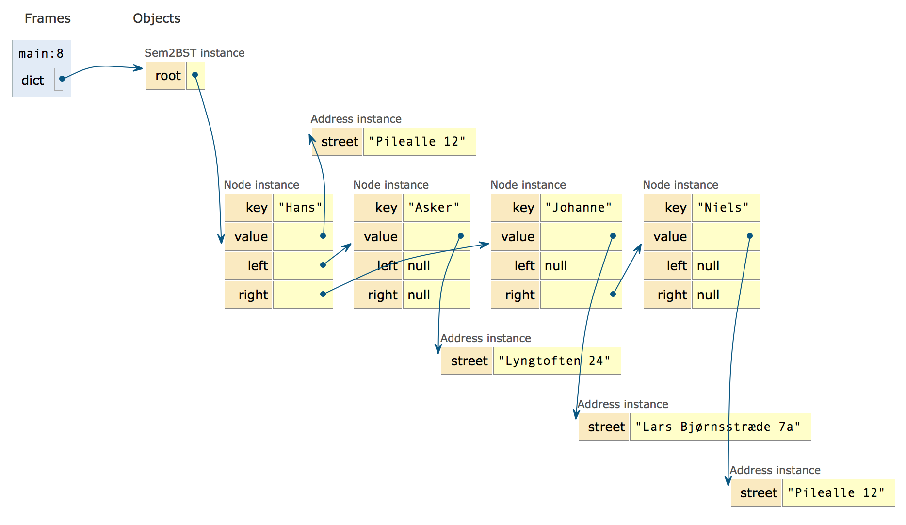
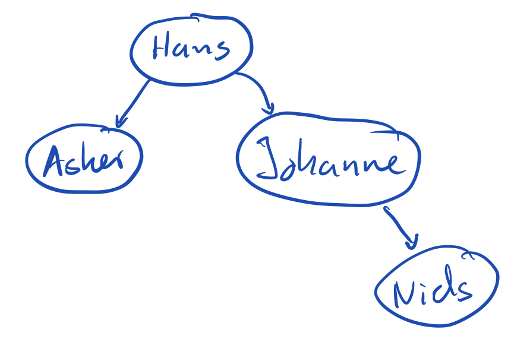
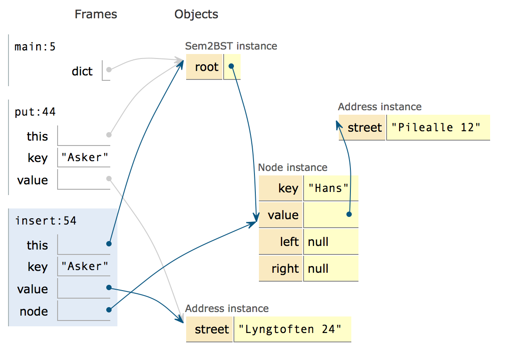
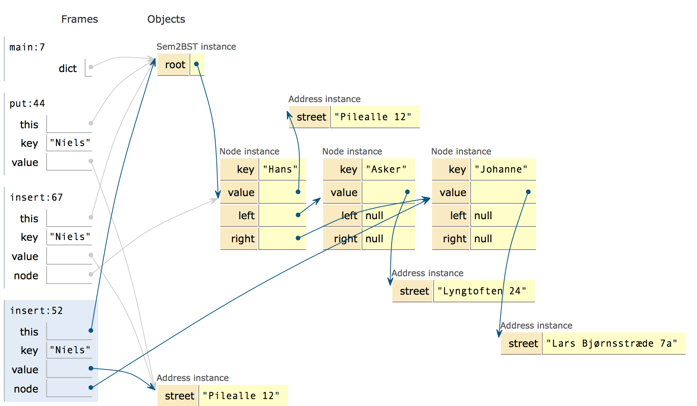

# Binary search tree
Our HashMap had the following operations:

- *get(Object key)* <br>
Returns the value to which the specified key is mapped, or null if this map contains no mapping for the key.
- *put(K key, V value)* <br>
Associates the specified value with the specified key in this map.
- *containsKey(Object key)*<br>
Returns true if this map contains a mapping for the specified key.
- *size()*<br>
Returns the number of key-value mappings in this map.
- *values()*<br>
Returns a Collection view of the values contained in this map.

We implemented this using hashCode and an extensible array. HashMaps is the common way to implement this simple interface.

However, the HashMap has one significant drawback: the values() method do not return the values in order. The binary search tree can implement the same methods and in addition return the values sorted by the key.

The idea behind a search tree is that we extend the key-value pair to include two references - so that each key-value pair knows which are smaller than the key, and which are larger.

In a binary search tree (sometimes just called a BST), one call the key-value pair for a node.

## Readings

I recommend you to take a look at the following Lynda.com videos to get the terminology of trees in place (15 min in all).

- [Introduction to tree data structure](https://www.lynda.com/Developer-Programming-Foundations-tutorials/Introduction-tree-data-structures/149042/177132-4.html)
- [Understanding binary search trees](https://www.lynda.com/Developer-Programming-Foundations-tutorials/Understanding-binary-search-trees-BST/149042/177133-4.html)

For those who are not video oriented:

- [This page gives an textual description](http://www.algolist.net/Data_structures/Binary_search_tree) for most of the operations we will be looking it.

## Example:

```java
public class Main {
    public static void main( String[] args ) {
        Sem2BST dict = new Sem2BST();
        dict.put("Hans", new Address("Pilealle 12"));
        dict.put("Asker", new Address("Lyngtoften 24"));
        dict.put("Johanne", new Address("Lars Bjørnsstræde 7a"));
        dict.put("Niels", new Address("Pilealle 12"));
    }
}
```

At the end of the main program, we will end up with this memory image:



That is, the dictionary (`dict`) has a single reference to the first inserted element. The "Hans" instance has "Asker" as its left (smaller) and "Johanne" as its right (larger) node instance. "Niels" is inserted as the right node (larger) of "Johanne". Often when drawing these trees one ignores the values, and merely draw the tree as:



You can look at the [put operation at pythontutor.](http://www.pythontutor.com/java.html#code=public%20class%20Main%20%7B%0A%20%20%20%20public%20static%20void%20main%28%20String%5B%5D%20args%20%29%20%7B%0A%20%20%20%20%20%20%20%20Sem2BST%20dict%20%3D%20new%20Sem2BST%28%29%3B%0A%20%20%20%20%20%20%20%20dict.put%28%22Hans%22,%20new%20Address%28%22Pilealle%2012%22%29%29%3B%0A%20%20%20%20%20%20%20%20dict.put%28%22Asker%22,%20new%20Address%28%22Lyngtoften%2024%22%29%29%3B%0A%20%20%20%20%20%20%20%20dict.put%28%22Johanne%22,%20new%20Address%28%22Lars%20Bj%C3%B8rnsstr%C3%A6de%207a%22%29%29%3B%0A%20%20%20%20%20%20%20%20dict.put%28%22Niels%22,%20new%20Address%28%22Pilealle%2012%22%29%29%3B%0A%20%20%20%20%7D%0A%7D%0Aclass%20Address%20%7B%0A%20%20String%20street%3B%0A%20%20Address%28String%20st%29%7B%0A%20%20%20%20street%20%3D%20st%3B%0A%20%20%7D%0A%7D%0Aclass%20Node%20%7B%0A%20%20%20%20String%20key%3B%0A%20%20%20%20Address%20value%3B%0A%20%20%20%20Node%20left%3B%0A%20%20%20%20Node%20right%3B%0A%0A%20%20%20%20Node%28%20String%20key,%20Address%20value%20%29%20%7B%0A%20%20%20%20%20%20this.key%20%3D%20key%3B%0A%20%20%20%20%20%20this.value%20%3D%20value%3B%0A%20%20%20%20%7D%0A%7D%0A%0Aclass%20Sem2BST%20%7B%0A%0A%20%20%20%20Node%20root%3B%0A%0A%20%20%20%20public%20boolean%20containsKey%28%20String%20key%20%29%20%7B%0A%20%20%20%20%20%20%20%20throw%20new%20UnsupportedOperationException%28%20%22Not%20supported%20yet.%22%20%29%3B%20//To%20change%20body%20of%20generated%20methods,%20choose%20Tools%20%7C%20Templates.%0A%20%20%20%20%7D%0A%0A%20%20%20%20public%20Address%20get%28%20String%20key%20%29%20%7B%0A%20%20%20%20%20%20%20%20throw%20new%20UnsupportedOperationException%28%20%22Not%20supported%20yet.%22%20%29%3B%20//To%20change%20body%20of%20generated%20methods,%20choose%20Tools%20%7C%20Templates.%0A%20%20%20%20%7D%0A%0A%20%20%20%20public%20void%20put%28%20String%20key,%20Address%20value%20%29%20%7B%0A%20%20%20%20%20%20%20%20if%20%28root%20%3D%3D%20null%29%0A%20%20%20%20%20%20%20%20%20%20%20%20root%20%3D%20new%20Node%28key,%20value%29%3B%0A%20%20%20%20%20%20%20%20else%0A%20%20%20%20%20%20%20%20%20%20%20%20insert%28key,%20value,%20root%29%3B%0A%20%20%20%20%7D%0A%0A%20%20%20%20public%20int%20size%28%29%20%7B%0A%20%20%20%20%20%20%20%20throw%20new%20UnsupportedOperationException%28%20%22Not%20supported%20yet.%22%20%29%3B%20//To%20change%20body%20of%20generated%20methods,%20choose%20Tools%20%7C%20Templates.%0A%20%20%20%20%7D%0A%0A%20%20%20%20private%20void%20insert%28%20String%20key,%20Address%20value,%20Node%20node%20%29%20%7B%0A%20%20%20%20%20%20%20%20switch%20%28%20Integer.signum%28%20key.compareToIgnoreCase%28%20node.key%20%29%20%29%20%29%20%7B%0A%20%20%20%20%20%20%20%20%20%20%20%20case%20-1%3A%0A%20%20%20%20%20%20%20%20%20%20%20%20%20%20%20%20if%20%28%20node.left%20%3D%3D%20null%20%29%20%7B%0A%20%20%20%20%20%20%20%20%20%20%20%20%20%20%20%20%20%20%20%20node.left%20%3D%20new%20Node%28%20key,%20value%20%29%3B%0A%20%20%20%20%20%20%20%20%20%20%20%20%20%20%20%20%7D%20else%20%7B%0A%20%20%20%20%20%20%20%20%20%20%20%20%20%20%20%20%20%20%20%20insert%28%20key,%20value,%20node.left%20%29%3B%0A%20%20%20%20%20%20%20%20%20%20%20%20%20%20%20%20%7D%0A%20%20%20%20%20%20%20%20%20%20%20%20%20%20%20%20break%3B%0A%20%20%20%20%20%20%20%20%20%20%20%20case%200%3A%0A%20%20%20%20%20%20%20%20%20%20%20%20%20%20%20%20node.value%20%3D%20value%3B%0A%20%20%20%20%20%20%20%20%20%20%20%20%20%20%20%20break%3B%0A%20%20%20%20%20%20%20%20%20%20%20%20case%201%3A%0A%20%20%20%20%20%20%20%20%20%20%20%20%20%20%20%20if%20%28%20node.right%20%3D%3D%20null%20%29%20%7B%0A%20%20%20%20%20%20%20%20%20%20%20%20%20%20%20%20%20%20%20%20node.right%20%3D%20new%20Node%28%20key,%20value%20%29%3B%0A%20%20%20%20%20%20%20%20%20%20%20%20%20%20%20%20%7D%20else%20%7B%0A%20%20%20%20%20%20%20%20%20%20%20%20%20%20%20%20%20%20%20%20insert%28%20key,%20value,%20node.right%20%29%3B%0A%20%20%20%20%20%20%20%20%20%20%20%20%20%20%20%20%7D%0A%20%20%20%20%20%20%20%20%20%20%20%20%20%20%20%20break%3B%0A%20%20%20%20%20%20%20%20%7D%0A%20%20%20%20%7D%0A%7D%0A%0A&cumulative=false&curInstr=0&heapPrimitives=false&mode=display&origin=opt-frontend.js&py=java&rawInputLstJSON=%5B%5D&textReferences=false)

Just as we saw with our HashMap, the are often two classes involded in an in implementation of a collection. In the case of the HashMap, it was the `Sem2HashMap` class and the `Array`. The array stores the data, and  `Sem2HashMap` provides the operations to make it convenient to access the array..

In the case of `Sem2BST`, it is the `Sem2BST` and the `Node` class. The `Node` class is used for storing the data, and `Sem2BST` makes it convenient to access the nodes.

If we examine the BST closer there is a single field called `root`. At first (step 7 in the code above) it is set to null. This represents that there is no elements in the BST.

Next, we insert Hans into the BST.

```java
dict.put("Hans", new Address("Pilealle 12"));
```

The `put` operation is implemented as:

```java
public void put( String key, Address value ) {
	if (root == null)
		root = new Node(key, value);
	else
		insert(key, value, root);
}
```

That is - if the BST is emptry, we can just make a new `Node` and make that new node the `root`. 

When we in the next line inserts "Asker", the `root` is no longer null, and we call the `insert` method:

```java
private void insert( String key, Address value, Node node ) {
    switch ( Integer.signum( key.compareToIgnoreCase( node.key ) ) ) {
        case -1:
            if ( node.left == null ) {
                node.left = new Node( key, value );
            } else {
                insert( key, value, node.left );
            }
            break;
        case 0:
            node.value = value;
            break;
        case 1:
            if ( node.right == null ) {
                node.right = new Node( key, value );
            } else {
                insert( key, value, node.right );
            }
            break;
    }
}
```

The condition in the switch compares the key ("Asker") to the key of the node we got as parameter (`root` - which is "Hans"). The method `X.compareToIgnoreCase(Y)` returns a negative number if `X` is less than `Y`, 0 if `X` equals `Y`, and a postive number if `X` is larger than `Y`.
The function `signum(Z)` returns -1 if `Z` is negative, 0 if it is 0, and 1 if it is possitive. All this allow us to perform just one comparison, and to use switch for the three cases:

In our case with the key to insert being "Asker" and the node being "Hans", we end in the first switch (step 39 in the pythontutor program):



As the left field of the "Hans" instance is `null`, we create a new `Node`, and update the `left` field of the "Hans" instance to refer to this new `Node` (steps 40 to 48).

### Recursion
If you look at the insert method in line 7 and 17 above, you can see that the method is calling itself. A method which call itself is called a *recursive* method. 

Recursion is often used to write methods that handles trees.

The recursion we use here is very typical. If we look at the -1 case:

```java
case -1:
    if ( node.left == null ) {
        node.left = new Node( key, value );
    } else {
        insert( key, value, node.left );
    }
    break;
```                

Losely explained, it says "If the situation is simple, handle it here, else call the method recursively with an argument which is not quite so large".

In our case - the argument `node` is the one we look at. If the `left` node is null (simple situation) we create a new node and store it. If it is not null, we call recursively (with the node to the left).

If we move on to where we are about to insert "Niels" (step 86, were we just entered the put operation). Follow the program closely until we are at step 93 where the memory image is:



The thing to pay attention to is that there are **two** frames on the stack for the insert method. One where we will insert "Niels" into the "Hans"-node, and then the one where we insert "Niels" into the "Johanne" node. 

*The important thing to remember about recursion is that each recursive call gets its own stack frame. Therefore the parameters, variables and `this` of each recursive call can be different.*

## Exercises

### Implementation
For Wednesday, You should be able to demo each of the methods calls using the Netbeans debugger:

- *get(Object key)* <br>
Returns the value stored with the key, or null if this bst contains no value for the key.
- *containsKey(Object key)*<br>
Returns true if this bst contains a value for the specified key.
- *size()*<br>
Returns the number of nodes in this bst.
- *keys()*<br>
Returns a list of the keys contained in this bst.

If there is some methods which you cannot get to work, you should have a test for the method (which fails as you have not implemented the method).

### Test
Write JUnit tests to test that the `put`, `size` and `keys` method works. You should be able to demo those tests.


### Advanced exercises
1. We have not looked at how to delete an element from a BST. This link gives [a description of how it can be done](http://www.algolist.net/Data_structures/Binary_search_tree/Removal).
	- Make sure you start by writing your tests, testing each of the three cases mention in the text.
2. If you really want to look into this, there are ways to make the tree stay balanced. One of the ways are AVL trees - This tutorial points page explains the insertion into balanced trees. You can try to implement this insertion in our put operation.
