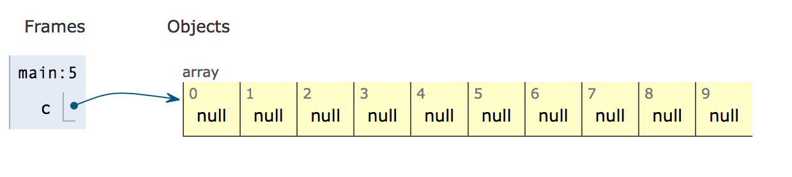
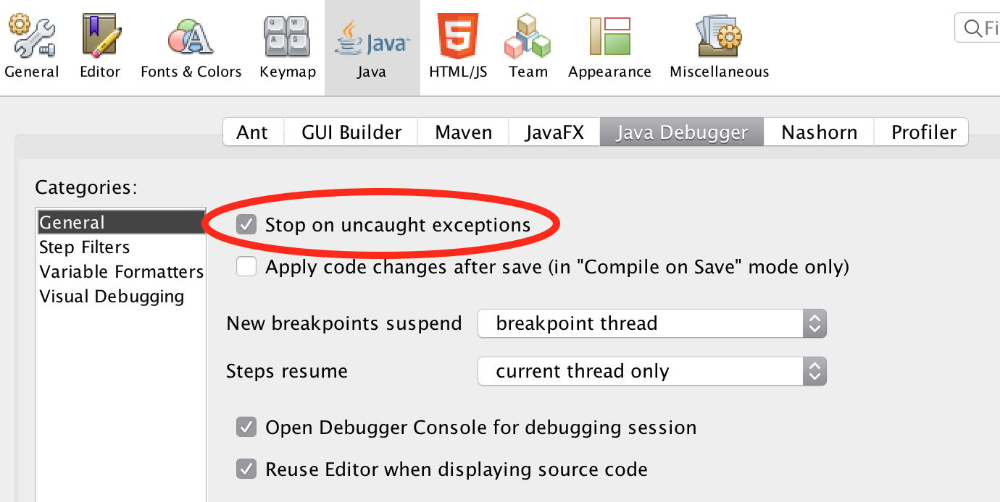
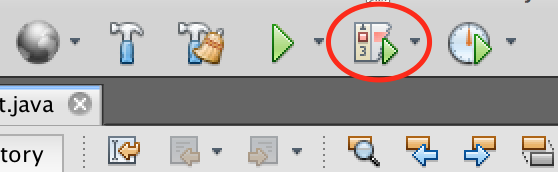
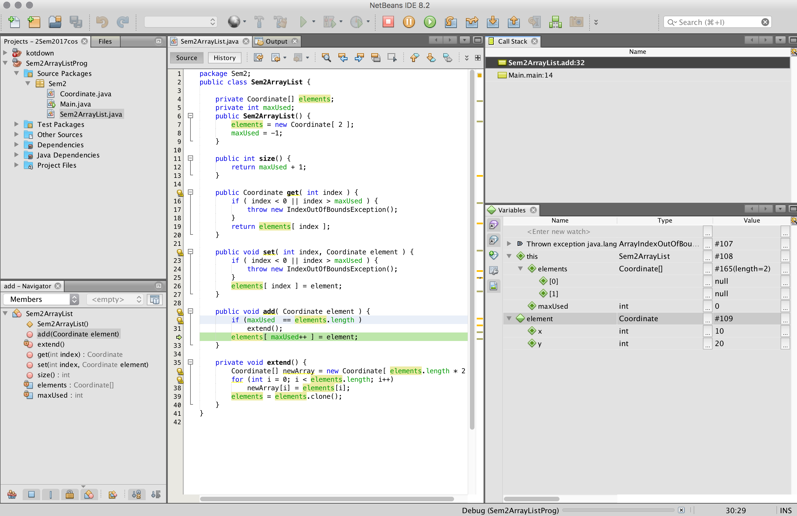
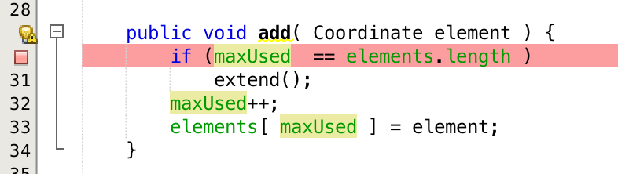
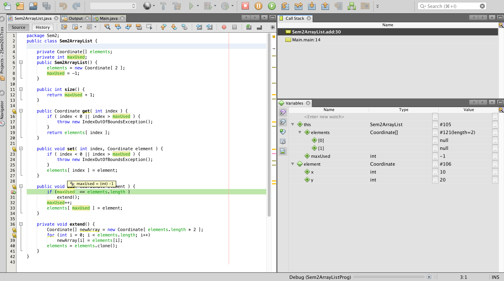

# Debugging and Arraylist 
After working on this note, you should be able to use the Netbeans debugger. The example  we will use is that of the ArrayList as it is does some cool stuff.

### Array

An array has a fixed size which we must give when the array is created. For example:

```java
Coordinate[] c; // declare an array of Coordinates
c = new Coordinate[10]; // Here we create an array of length 10
```

After the array has been created, it looks like this:



This work well if we know the size we want to use, often we do not know that beforehand. 

### ArrayList
An array list is one of the *container classes* in Java. It is used to store other objects. It has a number of operations to help us do so. We will take a closer look at these four and the constructor.

- *get(int index)* <br>
Returns the element at the specified position in this list.
- *set(int index, E element)*<br>
Replaces the element at the specified position in this list with the specified element.
- *size()* <br>
Returns the number of elements in this list.-
- *add(E e)* <br>
Appends the specified element to the end of this list.

There are two parts of ArrayList - *Array* and *List*. *Array* mean we can use integer index from 0 to length of array to find a stored element. *List* means we can add elements to the end without having to worry about any build in restriction.

#### So how to combine Array and List
It seems impossible to make an arraylist. An array has a fixed size, and we must be able to add an unknown number of elements to a list.

First we need to declare our own ArrayList. 

```java
class Sem2ArrayList {
	public int size(){...}
	public Coordinate get(int index){...}
	public void set(int index, Coordinate element){...}
	public void add(Coordinate element)	{...}
}
```

We want to be able to use it like this:

```java
class OurMainProgram {
    public static void main(String[] args) {
		Sem2ArrayList c; // declare an arraylist of Coordinates
		c = new Sem2ArrayList(); // Here we create an arraylist
		for (int i = 10; i < 100; i++){
			c.add( new Coordinate(i, i*2 ))
		}
    }
}
```

That is, we want to be able to add elements to the arraylist, without saying in line 4 how many elements we want to add.

There are three ideas behind how we store the elements in the arraylist:

1. We use an array to store the elements. 
2. The array is longer than the list, so we have a variable `maxUsed` to remember how much of the array is currently used for the elements.
3. When we run out of space, we make a new array which is longer, and copy all the existing elements to that array.

The code (including misc errors) looks something like this:

```java
public class Sem2ArrayList {

    private Coordinate[] elements;
    private int maxUsed;

    public Sem2ArrayList() {
        elements = new Coordinate[ 2 ];
        maxUsed = -1;
    }

    public int size() {
        return maxUsed + 1;
    }

    public Coordinate get( int index ) {
        if ( index < 0 || index > maxUsed ) {
            throw new IndexOutOfBoundsException();
        }
        return elements[ index ];
    }

    public void set( int index, Coordinate element ) {
        if ( index < 0 || index > maxUsed ) {
            throw new IndexOutOfBoundsException();
        }
        elements[ index ] = element;
    }

    public void add( Coordinate element ) {
        if (maxUsed  == elements.length )
            extend();
        elements[ maxUsed++ ] = element;
    }

    private void extend() {
        Coordinate[] newArray = new Coordinate[ elements.length * 2 ];
        for (int i = 0; i < elements.length; i++)
            newArray[i] = elements[i];
        elements = elements.clone();
    }
}
```

The full code including the main and the coordinate class is at Github at [TODO: Add link]

## Debugger

The above program does not work. When run it comes out with a long text in the output, which include the following two lines:

```
Exception in thread "main" java.lang.ArrayIndexOutOfBoundsException: -1
	at Sem2.Sem2ArrayList.add(Sem2ArrayList.java:32)
	at Sem2.Main.main(Main.java:14)
```

It says that we refer an array at index -1 in line 32 of the add method in Sem2ArrayList class, which was called from the main method in line 14.

Instead of starting to insert System.out.println into the code to see what happens, we use the debugger.

#### Setting up the debugger
As usual the settings are never as they should be, so lets the important checkmark in Netbeans.

In the preferences/options of Netbeans we need to set the "Stop on uncaught exceptions"



### Debugging an exception
One way to start the debugger is to press the "Debug" button next to the "run" button:



This should (in principle) bring up the following windows:



This might not be the windows you see, or they might not sit this way with you. However, these are the ones I prefer in debugging as it gives me an overview of:

- The code being debugged - in this case the green line 32 shows how far the program got.
- The call stack window (Can be openend from the Windows>Debugging>Call stack menu). The call stack show which call-stack frames are on the stack at the moment, and which line is currently executing.
- The variables window (Can be found the same place), shows the variables of the current stack-frame. **Notice in particular the "this" variable**.

The debugger do not have a window to show the heap as such, but one can follow the references from the variables window by opening the little triangles.

#### Hovering in the code view
You can also see the values of variables by simply moving the cursor over the variables in the code.

It is also possible to see the value of an expression by selecting the expression and then hovering over the selection (for example, select the expression in line 30 to see that it evaluates to true)


### Spotting the error
We can see two things:

- We got a indexoutofbounds error with index -1
- The debugger says maxUsed is 0

This has to do with how the `++` operator works. If `x` has the value 7, the expression `x++` has the value 7, and then `x` is incremented to 8.

Thus, maxUsed should be incremented before we used it as index.

To help debugging, and to help other programmers by not having to remember this, only use the ++ operator as a seperate statement.

Stop the debugger by pressing the big red square in the tools bar.

Rewrite `elements[ ++maxUsed ] = element;` to `maxUsed++; elements[ maxUsed ] = element;`

And run the debugger again.

This time we get an index error of refering to index 2. 

### Setting a breakpoint
You can ask the program to stop when it reaches a specific line. To do so you click in the linenumber where you want to program to stop. Try to make a breakpoint in the first line of the add method. This should make the line be marked in red:



When you debug the program, it will now stop just before this line is executed. For me, this looks like:



To the right of the big red square in the top line, there are a number of other buttons which can be used to step through the code.

#### Stepping in the debugger
There are three movements in the debugger which you use to move through the code to help you spot errors.

- **StepOver:**  will execute the statment you are standing at, and stop at the next statement.
- **StepInto:**  is only useful if the line you are looking at contains a method call. In that case this method will be called, and the debugger will stop again before the first line of that method.
- **StepOut:**  will return from the current method and stop at the next method in the call stack.

Finally, the big round green arrow will resume running until the next breakpoint.

Try to use these, and see if you can find the error.

#### The final error (I think)
After fixing the previous error with index out of range, we immediate get a new index error.

Again, set the breakpoint at the first line of the `add` method, but this time make sure you *StepInto* the `extend` method.

>Step through this method statement for statement, and see how the variables change in the variables window. Remember to have all the variables unfolded (using the little arrow)

## Debugging tricks
There are a few tricks worth remembering:

- Turn on the "Stop on uncaught exceptions" as described in the section  "Setting up the debugger".
- You cannot run the program backwards, so expect to re-start the debugger many times to find where the error occours.
- Remember the hover in the code itself, it is mostly faster than the variables window.
- If you start debugging from an exception, it is often a good idea to set a breakpoint before the location of the exception to see what happens before it goes wrong.

## The debugger can do more
Besides the things we have covered in this note, the debugger can also:

- list all the breakpoints you have set in your program (Windows>>Debugger)
- **Conditional breakpoints**. By right clicking on the breakpoint in the linenumber column, you can select "Properties". Here you can specify that the break point should only break after the 10th time, or every fith time or such. It is also possible to specify that a condition should be true before the breakpoint activates.
