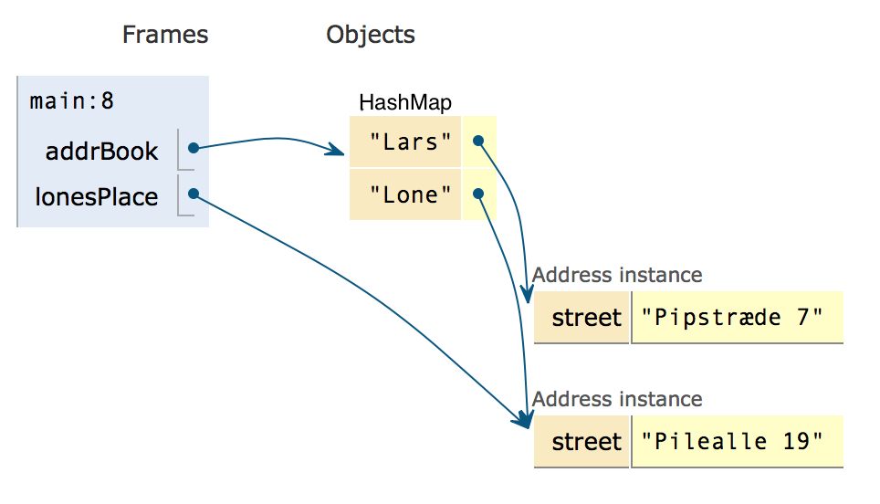
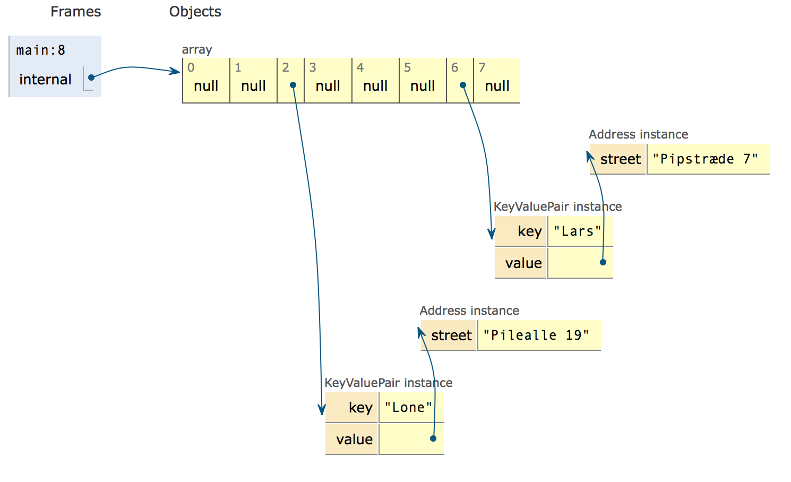

# HashMap
A arraylist allow us to store store a number of elements, and then later retrieve them based on an *integer* index.

Sometimes we do not want to work with integer index, but to use strings or something else. Forexample, an address book allow us to find address based on a string (a name). 

For example, running this code

```java
HashMap<String, Address> addrBook = new HashMap<>();
addrBook.put("Lars", new Address("Pipstræde 7"));
addrBook.put("Lone", new Address("Pilealle 19"));

Address lonesPlace = addreBook.get("Lone");
```
will result in this memory picture:



A hashmap is a container that can store its **elements** indexed by a **key**. 

Sometimes hashmaps are also used to overcome an other limitation of array and arraylist, namely that arrays are indexed from 0 and forth.

If we want to store persons based on their CPR number it is impractical as all CPR numbers are 10 digits long, and as such the first 999.999.999 elements could not be used.

The Java hashmap has a lot of operations, but for this note we will only look at a few of them:

- *get(Object key)* <br>
Returns the value to which the specified key is mapped, or null if this map contains no mapping for the key.
- *put(K key, V value)* <br>
Associates the specified value with the specified key in this map.
- *containsKey(Object key)*<br>
Returns true if this map contains a mapping for the specified key.
- *size()*<br>
Returns the number of key-value mappings in this map.
- *values()*<br>
Returns a Collection view of the values contained in this map.

### Different names for Hashmap
The hashmap is so popular in programming that it has been invented over and over. Some call it a **Dictionary** (because one can look up things), or **Symbol table** (Hashmaps play an important role inside compilers, where such things originally was called symbol tables), or **Map** (which is the mathematical term for something which take a key and returns a value), or **associative array** because it is an array which can use anything as index.

## How HashMap works

The fundamental idea in a HashMap is to use a hash key. A hashkey is an integer. In java, all objects can produce a hashcode using the `hashCode()` method. For example, the hashCode of the string "Lone" is `2374298`. (And "Lars" has `2360982`)

Internally a HashMap stores its values in an array of Key-Value objects (objects with two fields - a key, and a value). 

The hashCodes are big numbers usually, and cannot be used directly for array index. Instead, if we have an array of size `N` then an index is computed using the modulus operator `%`.

This program puts it together:

```java
public class YourClassNameHere {
    public static void main(String[] args) {
      KeyValuePair[] internal = new KeyValuePair[8];
      internal["Lars".hashCode()%8] 
        = new KeyValuePair("Lars", new Address("Pipstræde 7"));
      internal["Lone".hashCode()%8]
        = new KeyValuePair("Lone", new Address("Pilealle 19"));
    }
}

class KeyValuePair {
  String key;
  Address value;
  KeyValuePair(String k, Address a){
    key = k; value = a;
  }
}

class Address {
  String street;
  Address(String st){
    street = st;
  }
}
```

At the end of the main method, the memory image is:



Line 4 and 5 inserts the address "Pipstræde 7" under key "Lars". Notice in line 4 how we compute the hashCode of "Lars", and then use `%` to get a number between 0 and 7. 

(If you have forgotten what modulus is, it is "division remainder", so if you divide 17 by 5, you get 3, with *a remainder of 2*. This is written as `17 % 3`. In our example what we do is `2360982 % 8` (the hashCode of "Lars" was 2360982), and 8 is the length of the array)

## Implementing our own HashMap
From the beginning of this note, we needed to implement a number of methods in our own HashMap. We will start by ignoring a two important aspects:

- ignore that the array we use might get full as we add elements to it 
- ignore that two keys might end up on the same index

This allow us to get this implementation which gives the basic outline of the HashMap:

```java
public class Sem2HashMap {

    private KeyValuePair[] internal;

    public Sem2HashMap() {
        internal = new KeyValuePair[ 3 ];
    }
    
    public Address get( String key ) {
        int index = key.hashCode() % internal.length;
        return internal[ index ].value;
    }    

    public void put( String key, Address value ) {
        int index = key.hashCode() % internal.length;
        KeyValuePair kp = new KeyValuePair( key, value );
        internal[ index ] = kp;
    }

    public boolean containsKey( String key ) {
        int index = key.hashCode() % internal.length;
        return internal[ index ] != null;
    }

    public int size() {
        int s = 0;
        for ( int i = 0; i < internal.length; i++ ) {
            if ( internal[ i ] != null ) {
                s++;
            }
        }
        return s;
    }
    
    public List<Address> values() {
        ArrayList<Address> all = new ArrayList();
        for ( int i = 0; i < internal.length; i++ ) {
            if ( internal[ i ] != null ) {
                all.add( internal[ i ].value );
            }
        }
        return all;
    }
}
```

Look at the code closely - are you sure there are no errors?

In the next note, we will look at how to write tests for Sem2HashMap, and we will fix the two problems mentioned above.

The code above is in a [Netbeans project at Github](https://github.com/DAT2Sem2017E/Modul1Sem2HashMap).
