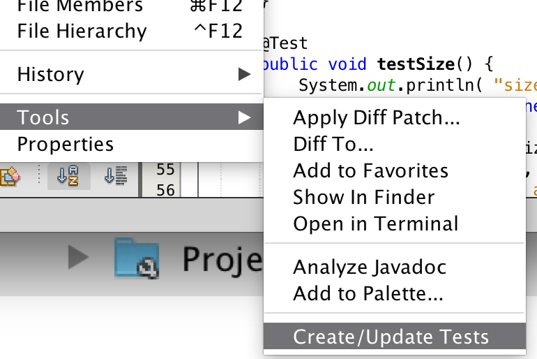

# JUnit - testing java programs

As we have seen over and over again we write small main mathods to try out if something works. 

We are not the first developers to have done that. 

These small main methods has a better way to be done, using a library called junit. In this note we will take a look on how to use junit to test our own HashMap.

In its simplest form, a *test method* will test one aspect of a *test subject*. A simple test method for the Sem2HashMap might be:

```java
@Test void initiallyEmpty(){
	Sem2HashMap hm = new Sem2HashMap();
	assertTrue( tm.size() == 0);
} 
```

This test method - it being a test method because of the `@Test` in front, will make a new instance of `Sem2HashMap`. The test is *succesful* if the size of the hashmap is 0 from the beginning.

## What should be tested?
The Sem2HashMap has a number of methods. If we take a look at the get method:

```java
public Address get( String key ) {
	int index = key.hashCode() % internal.length;
	return internal[ index ].value;
}
```

What can be done to test this method? 

I would suggest two tests. 

One to see if `get` returns null if the key we provide does not exists. One test method could therefore look like this:

```java
    @Test
    public void testGet() {
        Sem2HashMap instance = new Sem2HashMap();
        Address result = instance.get( "dummy" );
        assertEquals( null, result );
    }
```

##### Exercise
- Why do this test fail? It fails with a null pointer exception. Try to write a small main program to use the Sem2HashMap and the debugger to find out where the problem is by calling the get method from the main program.

- is the problem in the test (are we testing for something we could not expect our program to do), or have we implemented the method wrongly?

> One of the important things in tests is that we are often forced to think about the details of how things are expected to work.

#### testing for a known key
The other test is one where we know the element is there. This test could look like this:

```java
@Test public void testPutGet() {
    String key = "Donald";
    Address value = new Address("Whitehouse 1");
    Sem2HashMap hm = new Sem2HashMap();
    hm.put( key, value );
    String street = hm.get( key ).street;
    assertEquals( "Whitehouse 1", street );
}
```
If this test succeeds, we are somewhat sure that both put and get works. If it fails we do not know if there error is in put og in get. It is often the case that a failure cannot point precisely at where an error is - though one should try to make the test as precise as possible.


## Netbeans support for unit tests
Netbeans (and all other developement systems) understand the need for testing, and has build in support for testing your classes.

If we load into netbeans the rather bad implementation of Sem2HashMap we ended up with in the note [TODO: Link to other note].

### Creating the tests for an existing class
In the project window, in the right menu for an existing class, there is a well hidden menu item called "Create/Update tests":


The right menu is nearly all the way down, one level out:



A window will open and ask you many options. Using the defaults will get us started just fine.

A new class will be created in the test section of the project.


Right menu of that file has a "Test File" entry. Selecting this will bring up a window which looks somewhat like this:


This is the window of the Netbeans *test runner*. Netbeans have made a number of test for us, which all fails or crashes. Let us take a look at one of the simple ones, `testSize`.

```java
@Test public void testSize() {
    System.out.println( "size" );
    Sem2HashMap instance = new Sem2HashMap();
    int expResult = 0;
    int result = instance.size();
    assertEquals( expResult, result );
    fail( "The test case is a prototype." );
}
```
All the automatically generated test method ends with a fail method, forcing us to take a look at each test method and edit it. In this case, the auto generated test method tests if the HashMap is empty from the beginning, which is an OK test.

Exercises:

1. remove the `fail` call and rerun the test by pressing the double green arrow in the test window. Now the testSize should be marked with a green checkmark.

1. The auto generated test for `size` checks if a newly created HashMap has size 0. Write an other test to see if the size is `1` after an element has been added.

1. Write two tests for `contains`, one where you make sure it returns false if an key is not there, and one where you make sure it returns true if an element is there.

1. Write two tests for `put`. One where you make sure that you can add a new key-value pair, and one where you ensure that adding a new value to an existing key overwrite the existing value (do not change the size, and get returns the latest value).

1. Finally, make the two tests methods for `get`. To turn these tests green, you might have to change the get method to return null in case the key is not there (instead of crashing as it does now).

## Finalizing HashMap
There are two problems with the current implementation of HashMap.

- It does not handle *collisions* - a collision in a HashMap is when the hashCode tries to place two value at the same index.
- It cannot grow as we keep inserting elements into the list.

### Handling collision
A collision happens when two hashcodes gives the same index in the array. Forexample, the hashcode for "Donald" is `2052666774` ,and the hashcode for "Lars" is `2360982`. If the array size is `12`, they will be stored at `2052666774 % 12`, and at `2360982 % 12`, which happens to be index `6`. 

After we have inserted "Lars" into the HashMap, the memory image will be this:


Next, we want to insert "Donald". But Donald also belong at index `6`.

There are several solutions to this issue. One is to find the next vacant index which is not used. So instead of inserting "Donald" at `6` like we would like to, we look for the next one not yet used - `7` in our case.

How do we then find "Donald" when we try to look up in the HashMap? Again, we compute the hashcode, and get index 6. But this time we have to look at the keyvalue pair to ensure the key is indeed "Donald", and if not, we have to look at the next index and check the key.

The memory image is:


#### dealing with the last index
What if we try to insert something at index 11, and that index is already used? There is no index 12!

If we "fall of to the right", we go back and look at index 0 instead.

Some like to think of this as a "circular array" - somehow picturing this in their head - use the image if it makes sense to you.


if you want to count in a circular array of length `N`, it can be done as this 

```java
index = (index + 1) % N`.
```
Try to examine it with index 0, 1, 10 and 11 and see what the next value of index is.

#### Exersise: Testing collision

Write a test case which ensures we get a collision on `put`.
It can be necessary to ensure that the Sem2HashMap has the right size for this to happen.

Right now we expect this test to fail, because we have not implemented the circular array and the collision handling yet.

#### Exercise: implement the circular array

This is a somewhat larger programming exercise, and is part of what you should hand in as this weeks assignment.

### Handling growth 
So far we have not handled the other problem with the `Sem2HashMap`, namely that it will not grow as more elements are `put`. 

The basic idea is the same as with the ArrayList - when the array gets full you create a new array and copy all the elements to the new array. 

There are two things that differs here though:

1. It turns out that to avoid too much collisions, it is a good idea to extend the array when it is around 75% full instead of waiting until it is all full
2. When copying to the new array, you need to compute new indexes. If the array growth from 12 to 24 in size, the % operator might give you new indexes.

#### Exercises
This is part of the the week handin. 


1. Change the implementation such that there is a `size` field in the class, which you update in the `put`, so you do not need a for-loop in the `size` method. 
2. Test that the size test still give the right result after this edit.

3. Write a test that will insert a large number of key-value pairs into Sem2HashMap. This loop will insert 100 key-value pairs:

	```java
	for(int k = 0; k<100; k++){
		String key = "Johanne-"+k;
		Address addr = "Egernvej "+k;
		hashmap.put( key, addr);
	}
	```
	We expect the test method to fail as we have not yet implemented the extend method in the HashMap.
	
4. Write a method which extends the internal array of the HashMap. The method should double the size of the HashMap. The general idea of the method is:
	- Keep a reference to the existing array - call it `old`.
	- allocate a new array twice as big to the `internal` array.
	- loop through the old array, and for all indexes which store a key value pair (that is, the value in the array is not `null`), use the `put` method to insert the key-value into the new array.

5. Write a test that ensures that the key-value pairs you inserted before extend are still there after the extend method. Also ensure that the size is the same (`size` tells how many key-value pairs there are, not how long the array is).

6. Change put so that it will call extend if the internal array grows beyond 75% of capacity.
