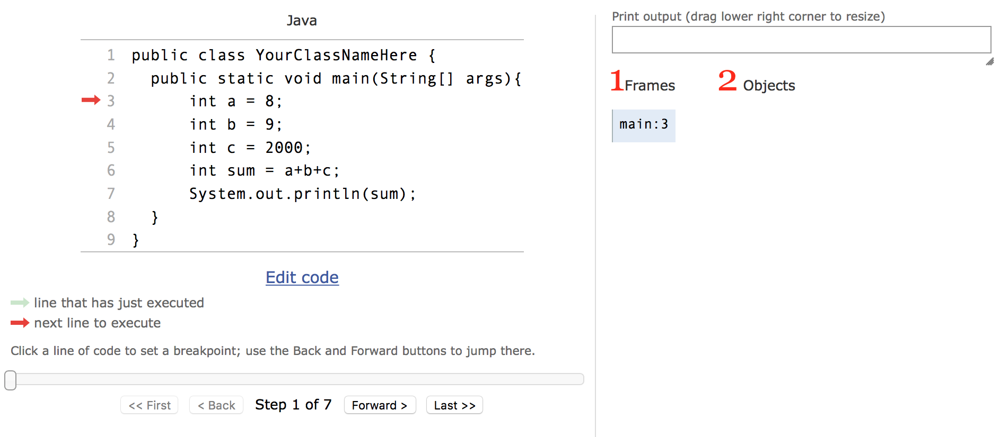
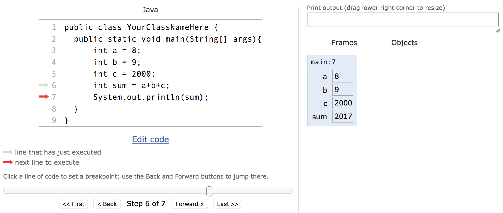
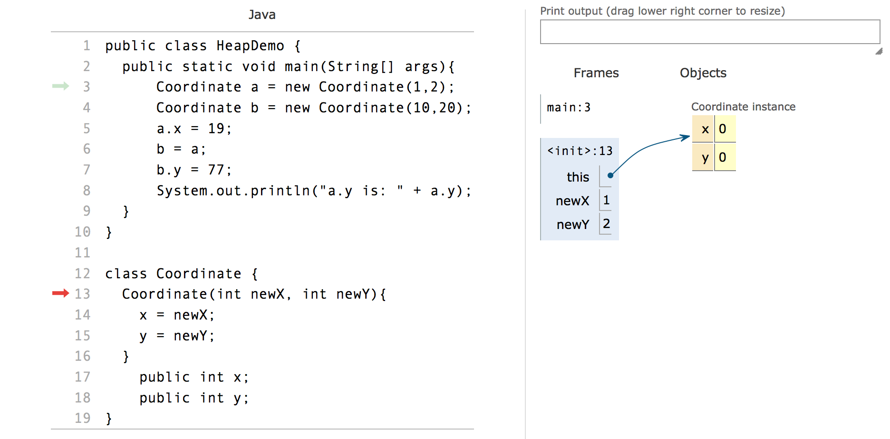
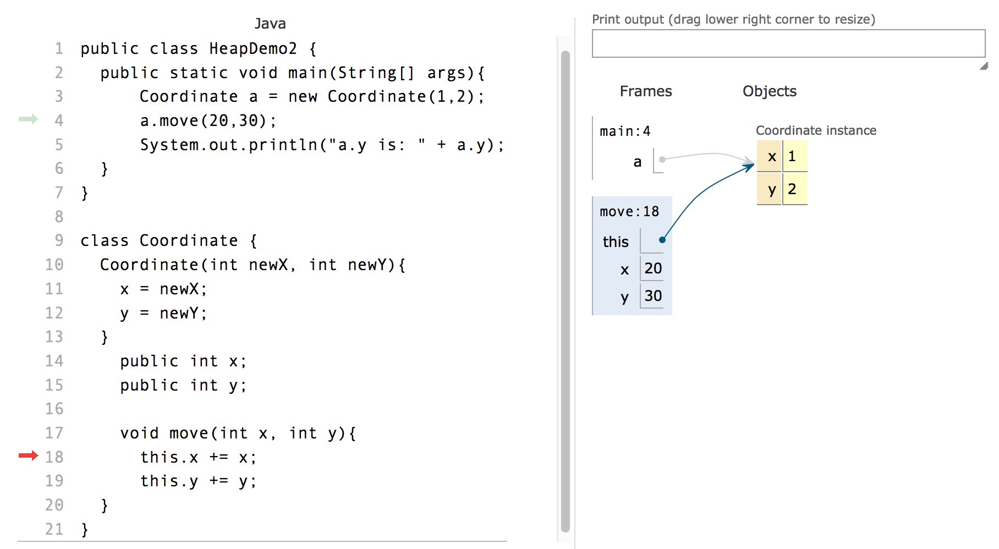
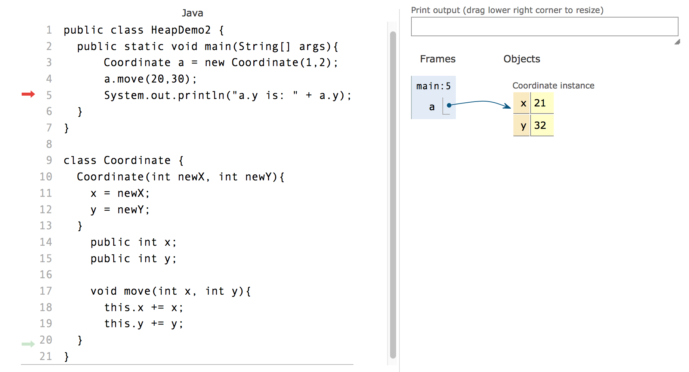
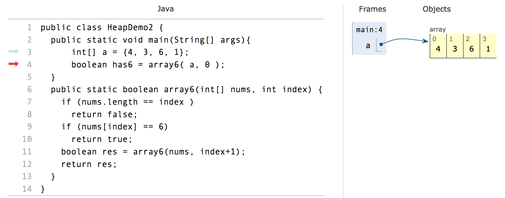
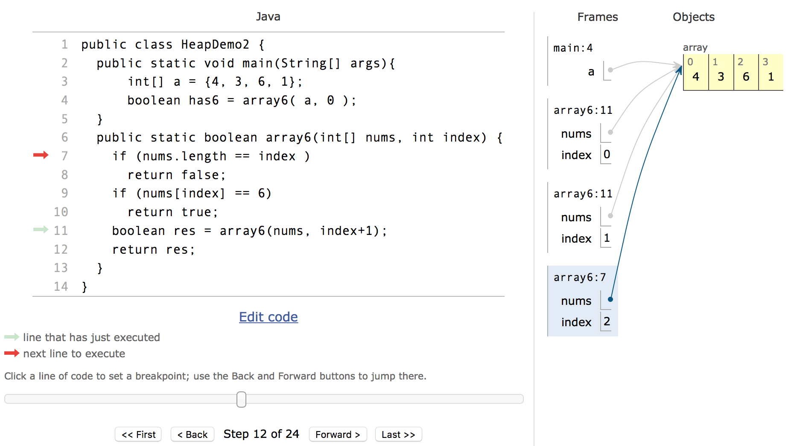
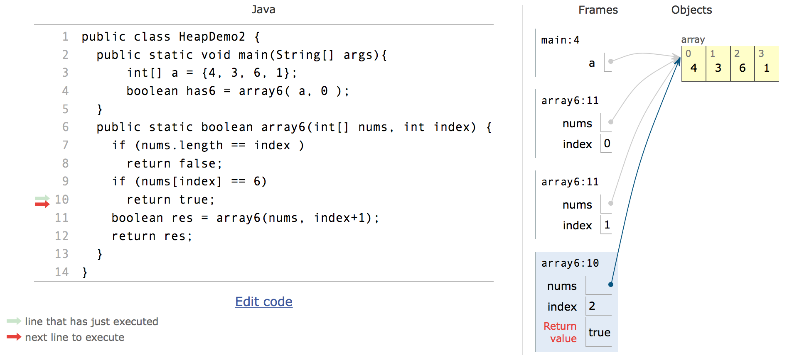

# Runtime of Java
A computer memory is basically a very long array of bytes. The run-time system of Java (and all other programming languages) tries to stucture this long array so you as programmer do not have to remember where things are stores using array index, but using Java variables and objects.

Java run-time (and all other programming languages) maintain two different kinds of structures for you:

- **Stack** is used for making method calls
- **Heap** is used for storing objects (including arrays and strings)

This note will try to present you with an overview of these two structures. You need to understand these two concepts in order to be able to use the *debugger*, a professional tool which should be used to find errors in programs instead of "System.out.println" calls.

The concepts will use a lot of graphical illustrations. There are many ways to draw the heap and the stack. They differ in their details, but at the overall level they are very similar. We will lean ourselves towards the notation used by the [pythontutor.com](http://www.pythontutor.com) home page. Exercises will be for that tool as well.

## The stack
The stack stores the variables used inside a method. That includes:

- parameters
- local variables
- loop variables 

The stack also keeps track of a few other things, 
but we will introduce them later as we need them.

### The main method
A Java program starts in a `static void main(String[] args)` method. If we look at this simple main method:

```java
public static void main(String[] args){
	int a = 8;
	int b = 9;
	int c = 2000;
	int sum = a+b+c;
	System.out.println(sum);
} 
```

If we paste this code into python tutor (selecting Java as the programming language) we get a page which looks like this:



To the left is the code from above. To the right there are two parts of the drawing (which I have numbered) - (1) Frames and (2) Objects. The stack from above is a stack of *frames*. 

As we have not started to execute the program (the red arrow on the left shows what is the next line to execute), there is not yet any variables in the main frame. Under the code there is a forward and backward botton. If we move forward until the next code to be executed is line 7, we get:



Here we can see that the *frame* for main now have an entry for each of the variables `a`, `b`, `c` and `sum`, and what their current value is.

This is what happens when you run the main method. 

1. A *frame* is created for the method
2. As variables are created they are added to the frame
3. As variables change value, the frame is updated (we did not see that in the method above though)

[Try it out yourself](http://www.pythontutor.com/java.html#code=public%20class%20YourClassNameHere%20%7B%0A%20%20public%20static%20void%20main%28String%5B%5D%20args%29%7B%0A%09%20%20int%20a%20%3D%208%3B%0A%20%20%09int%20b%20%3D%209%3B%0A%20%20%09int%20c%20%3D%202000%3B%0A%09%20%20int%20sum%20%3D%20a%2Bb%2Bc%3B%0A%09%20%20System.out.println%28sum%29%3B%0A%20%20%7D%20%0A%7D&cumulative=false&curInstr=5&heapPrimitives=false&mode=display&origin=opt-frontend.js&py=java&rawInputLstJSON=%5B%5D&textReferences=false).
*Notice it might take some seconds before the program loads.*

#### Exercise
Try change line 4 from `int b = 9;` to these two lines:

```java
	int b = 0;
  	for (b = 5; b<9; b++);
```
(You can edit the code by pressing the "Edit code" link below the code). 
Step through the code and see how the value of b changes in the frame.

### Calling a static method

When a method is *called* a new *frame* is created on the stack. If we look at [this simple program](http://www.pythontutor.com/java.html#code=public%20class%20CallingStaticMethod%20%7B%0A%20%20public%20static%20void%20main%28String%5B%5D%20args%29%7B%0A%09%20%20int%20a%20%3D%208%3B%09%0A%09%20%20int%20b%20%3D%209%3B%0A%20%20%09int%20year%20%3D%20twothousand%28%20a%20%2B%20b%20%29%3B%0A%09%20%20System.out.println%28year%29%3B%0A%20%20%7D%20%0A%20%20%0A%20%20public%20static%20int%20twothousand%28int%20shortYear%29%7B%0A%20%20%20%20int%20fullYear%20%3D%202000%20%2B%20shortYear%3B%0A%20%20%20%20return%20fullYear%3B%0A%20%20%7D%0A%7D&cumulative=false&curInstr=0&heapPrimitives=false&mode=display&origin=opt-frontend.js&py=java&rawInputLstJSON=%5B%5D&textReferences=false), pay particular attention to step 5. When the `twothousand` method is called, a new frame is added to the stack (in computer science we have never been able to agree if a stack grows upwards or downwards - here it is down).

The new frame for `twothousand` has the parameter `shortYear` initialized with the argument 17 (sum of a and b in `main`). In step 8 a return value is computed (to be the value of the fullYear variable), in step 9, the return is executed.

Returning from a frame you return to the frame above you, here the main method. The value which is returned was the one we just saw in step 8, and it is assigned the `year` variable of main in step 10. 

In summary the following steps are taken by the Java runtime when executing a static method:

1. The arguments are computed
2. A new frame is created, with the parameters set to the arguments from 1.
3. The body of the method is executed using the paramters and variables from the frame.
4. A return value is computed and remembered in a special place by the Java machine
5. The frame is removed, and execution continues where we left the calling method. The return value is used in this new frame.

#### Exercise
Try to change the program such that there is no `fullYear` variable, but just a `return 2000 + shortYear` statement. 

## The heap
All variables in a frame are lost when we return from a frame. Only the return value exist and can be used afterwards.

The way to keep variables alive independent of method frames is to use objects with fields (the variables of the object).

When you create a new object (using the new operator or calling a method which returns a new object) that object is put in an area of memory called **the heap**.

An object stays on the heap as long as any variables or fields refer to it.

Let see a simple example:

```java
public class HeapDemo {
  public static void main(String[] args){
	  Coordinate a = new Coordinate(1,2);
	  Coordinate b = new Coordinate(10,20);
	  a.x = 19;
	  b = a;
	  b.y = 77;
	  System.out.println("a.y is: " + a.y);
  }
}

class Coordinate {
  Coordinate(int newX, int newY){
    x = newX; 
    y = newY;
  }
	public int x;
	public int y;
}
```

We can try to [execute the program using pythontutor.com](http://www.pythontutor.com/java.html#code=public%20class%20HeapDemo%20%7B%0A%20%20public%20static%20void%20main%28String%5B%5D%20args%29%7B%0A%09%20%20Coordinate%20a%20%3D%20new%20Coordinate%281,2%29%3B%0A%09%20%20Coordinate%20b%20%3D%20new%20Coordinate%2810,20%29%3B%0A%09%20%20a.x%20%3D%2019%3B%0A%09%20%20b%20%3D%20a%3B%0A%09%20%20b.y%20%3D%2077%3B%0A%09%20%20System.out.println%28%22a.y%20is%3A%20%22%20%2B%20a.y%29%3B%0A%20%20%7D%0A%7D%0A%0Aclass%20Coordinate%20%7B%0A%20%20Coordinate%28int%20newX,%20int%20newY%29%7B%0A%20%20%20%20x%20%3D%20newX%3B%20y%20%3D%20newY%3B%0A%20%20%7D%0A%09public%20int%20x%3B%0A%09public%20int%20y%3B%0A%7D&cumulative=false&curInstr=0&heapPrimitives=false&mode=display&origin=opt-frontend.js&py=java&rawInputLstJSON=%5B%5D&textReferences=false).

In step three you should see an image like this:



In the Frames you see that we are in a frame named "<init>". That is the constructor. When the constructor is called, the Coordinate object is already created with its x and y field.

The constructor frame (and all non-static method frames) has a special variable called *this*. It refers to the object we are initializing.

In step 6 we have just executed the code in line 14, and the value of x is set to the value of newX (that is, set to 1).

If you remember, when x is a field, you can write either just `x` or `this.x`. It is the same, the java compiler makes `x` into `this.x`. Here `this` refers to the newly created object instance, and that is exactly what we want.

Follow the execution until you are at step 18, where both Coordinates are created. Then in the last steps make sure you understand how the values in the Coordinates change, and in particular why the program write 77 in the last step.

### The this pointer
The special *this* variable is not only used in connection with the constructor, but also in connection with regular (non-static) methods. Let us expand the example above with a method which can move a Coordinate.

```java
void move(int x, int y){
	this.x += x;
	this.y += y;
}
```

[The code is in pythontutor](http://www.pythontutor.com/java.html#code=public%20class%20HeapDemo2%20%7B%0A%20%20public%20static%20void%20main%28String%5B%5D%20args%29%7B%0A%09%20%20Coordinate%20a%20%3D%20new%20Coordinate%281,2%29%3B%0A%09%20%20a.move%2820,30%29%3B%0A%09%20%20System.out.println%28%22a.y%20is%3A%20%22%20%2B%20a.y%29%3B%0A%20%20%7D%0A%7D%0A%0Aclass%20Coordinate%20%7B%0A%20%20Coordinate%28int%20newX,%20int%20newY%29%7B%0A%20%20%20%20x%20%3D%20newX%3B%20%0A%20%20%20%20y%20%3D%20newY%3B%0A%20%20%7D%0A%09public%20int%20x%3B%0A%09public%20int%20y%3B%0A%09%0A%09void%20move%28int%20x,%20int%20y%29%7B%0A%20%20%09this.x%20%2B%3D%20x%3B%0A%09%20%20this.y%20%2B%3D%20y%3B%0A%20%20%7D%0A%7D&cumulative=false&curInstr=9&heapPrimitives=false&mode=display&origin=opt-frontend.js&py=java&rawInputLstJSON=%5B%5D&textReferences=false), and we move to step 11 when the Coordinate has been created, and the move method has just been called:



The frame for move include `this`, and the two parameters `x`and `y`. Notice how the `this` in the move frame and the `a` in the main frame refer to the same object. In a method call on the form `aaa.foo(1,2,3)` the object refered to by `aaa` become the `this` variable in the frame for the `foo` call.

Also notice that the frame for `main` do not have a `this` variable. That is because it is static.

In steps 13 and 14 the two parameters are added to the two fields of the Coordinate object. Notice how in step 15 the return value is null, the move method does not return anything, but changes the fields of the `this` object, and in step 16 we see this:



that is, when we return from `move`, the effect was that the object refered to by `a` was changed.

## Recursion

Recursion is when a method calls itself. Recursion is always based on using the frame stack. We will illustrate this using the [*array6* codingbat exercise](http://codingbat.com/prob/p108997).
> Given an array of ints, compute recursively if the array contains a 6. We'll use the convention of considering only the part of the array that begins at the given index. In this way, a recursive call can pass index+1 to move down the array. The initial call will pass in index as 0.

> array6([1, 6, 4], 0) → true <br>
> array6([1, 4], 0) → false<br>
> array6([6], 0) → true

I have made [a solution in pythontutor](http://www.pythontutor.com/java.html#code=public%20class%20Recursion%20%7B%0A%20%20public%20static%20void%20main%28String%5B%5D%20args%29%7B%0A%09%20%20int%5B%5D%20a%20%3D%20%7B4,%203,%206,%201%7D%3B%0A%09%20%20boolean%20has6%20%3D%20array6%28%20a,%200%20%29%3B%0A%20%20%7D%0A%20%20public%20static%20boolean%20array6%28int%5B%5D%20nums,%20int%20index%29%20%7B%0A%20%20%20%20if%20%28nums.length%20%3D%3D%20index%20%29%20%0A%20%20%20%20%20%20return%20false%3B%0A%20%20%20%20if%20%28nums%5Bindex%5D%20%3D%3D%206%29%20%0A%20%20%20%20%20%20return%20true%3B%0A%20%20%20%20boolean%20res%20%3D%20array6%28nums,%20index%2B1%29%3B%0A%20%20%20%20return%20res%3B%0A%20%20%7D%0A%7D&cumulative=false&curInstr=0&heapPrimitives=false&mode=display&origin=opt-frontend.js&py=java&rawInputLstJSON=%5B%5D&textReferences=false).
Just before the first call to `array6`, the situation is this:



Notice, arrays are put on the heap with a reference from the frame stack. 

At step 12, we are in this situation:



Notice, there are three frames of the `array6` method. Each frame have the same variables because they are frames of the same method. The `nums` array all refer to the same array in the heap. But the `index` parameter is different for each frame. 

Also notice the little number after the method name in the stack frame. It shows where the program will continue when we return to that frame. If we look at the main frame, we can see that when we return to main, we will continue at line 4.
If we look at the two `array6` frames with index 0 and 1, we can see that when we get back, we will continue at line 11 (which is where we call the `array6` method recursively). 

If we step to 16 we see:



that is, we did find a 6 at index 2, and will return true to the frame above us.

That brings us to step 17, where we return to the `array6` frame with index 1, and we resume execution in line 11 (as was shown in the line number stored in the frame). Step 18 assigns the return value to the variable `res`, and step 19 returns `true` back to the `array6` frame with index 0. 

Finally in step 23 we are back to the main method and step 24 assigns the `true` returned by the `array6` call to the `has6` variable of `main`.

#### Fibonacci exercise

In coding bat there is this exercise called fibonacci:

>The fibonacci sequence is a famous bit of mathematics, and it happens to have a recursive definition. The first two values in the sequence are 0 and 1 (essentially 2 base cases). Each subsequent value is the sum of the previous two values, so the whole sequence is: 0, 1, 1, 2, 3, 5, 8, 13, 21 and so on. Define a recursive fibonacci(n) method that returns the nth fibonacci number, with n=0 representing the start of the sequence.

>fibonacci(0) → 0 <br>
>fibonacci(1) → 1 <br>
>fibonacci(2) → 1 <br>

The following java method solves the fibonacci coding bat:

```java
public int fibonacci(int n) {
  if (n == 0) return 0;
  if (n == 1) return 1;
  int nMinus1 = fibonacci(n-1);
  int nMinus2 = fibonacci(n-2);
  return nMinus1 + nMinus2;
}
```
Try to [put it in pythontutor](http://www.pythontutor.com/java.html#mode=edit) and make a call from the main method with argument 3. *Remember to make the method static in pythontutor*.


Exercises:

1. How many frames are created in total when you run the program?
2. How many frames are created where the parameter is 1?

[comment]: # (Solution: http://www.pythontutor.com/java.html#code=public%20class%20Fibonacci%20%7B%0A%20%20%20%20public%20static%20void%20main%28String%5B%5D%20args%29%20%7B%0A%20%20%20%20%20%20int%20fib3%20%3D%20fibonacci%283%29%3B%0A%20%20%20%20%7D%0A%20%20%20%20%0A%20%20public%20static%20int%20fibonacci%28int%20n%29%20%7B%0A%20%20%20%20if%20%28n%20%3D%3D%200%29%20return%200%3B%0A%20%20%20%20if%20%28n%20%3D%3D%201%29%20return%201%3B%0A%20%20%20%20int%20nMinus1%20%3D%20fibonacci%28n-1%29%3B%0A%20%20%20%20int%20nMinus2%20%3D%20fibonacci%28n-2%29%3B%0A%20%20%20%20return%20nMinus1%20%2B%20nMinus2%3B%0A%20%20%7D%0A%7D&cumulative=false&curInstr=0&heapPrimitives=false&mode=display&origin=opt-frontend.js&py=java&rawInputLstJSON=%5B%5D&textReferences=false)
