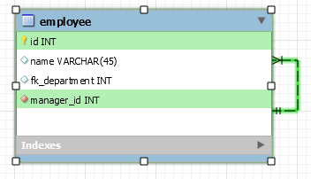
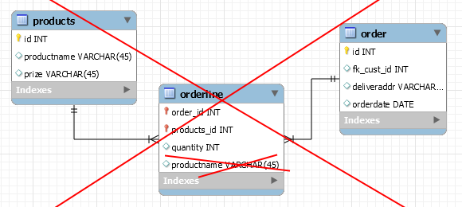

# Database design.

## DDL og DML: Struktur og indhold af databaser
Vi vil kigge på hvordan designer en database i forhold til at lave relationer mellem tabeller, sikre data integritet og lave CRUD operationer fra vores Java programmer.

### Oversigt over ugen:  

| Dag     | Emne                                     |
| ------- | ---------------------------------------- |
| Mandag  | Klasseundervisning og gruppedannelse     |
| Tirsdag | Vejledning med tutorer: Lav [Øvelse 1](exercises/SQLex1.md) og [Øvelse 2](exercises/DDLexercise2.md) |
| Onsdag  | Arbejd videre med Øvelse 1 og 2. Gennemgang af jeres arbejde - vejledning og feedback midtvejs ved review. |
| Torsdag | Vejledning med tutorer: Lav [Øvelse 3](exercises/NormaliseringEx3.md) og [Øvelse 4](exercises/DatabaseExercise4.md) |
| Fredag  | Arbejd videre med Øvelse 3 og 4. Review med Kasper og Thomas - Demo af jeres arbejde |

### Oversigt over mandagen:  

| Emne                             | Ressourcer                               |
| -------------------------------- | ---------------------------------------- |
| 1: Relationelle databaser og SQL | [Lynda.com video kursus om MySql](https://www.lynda.com/MySQL-tutorials/SELECT-statement/139986/173303-4.html?org=cphbusiness.dk): Se kapitel 2-6 + 8, [Workbench](https://dev.mysql.com/doc/workbench/en/): Reference materiale til opslag. |
| 2: DML                           | Data Manipulation Language: CRUD operationer - [MySQL Tutorial](http://www.mysqltutorial.org/basic-mysql-tutorial.aspx): Grundig online MySql bog som i kan læse i når der er tid. |
| 3: Complex SELECT statements:    | [Inner](http://www.mysqltutorial.org/mysql-inner-join.aspx), [Left/Right join](http://www.mysqltutorial.org/mysql-left-join.aspx) - Aggregate functions:    [AVG](http://www.mysqltutorial.org/mysql-avg/), [COUNT](http://www.mysqltutorial.org/mysql-row-count/), [MIN](http://www.mysqltutorial.org/mysql-min/) , [MAX](http://www.mysqltutorial.org/mysql-max-function/), [SUM](http://www.mysqltutorial.org/mysql-sum/) - [Sub queries](http://www.mysqltutorial.org/mysql-subquery/) - Operators: AND, OR, NOT, =, <>, >=, BETWEEN, IN, LIKE with [WILDCARDS](http://www.mysqltutorial.org/mysql-like/) and [ALIAS](http://www.mysqltutorial.org/mysql-alias/) - ANY vs. ALL - [UNION](http://www.mysqltutorial.org/sql-union-mysql.aspx) |
| 4: Modelering                    | [Domain model](http://stg-tud.github.io/eise/WS11-EiSE-07-Domain_Modeling.pdf) udledt fra kravsspecifikationen [(Conceptual model)->(Logical model)-> (Physical Database model)](https://www.visual-paradigm.com/support/documents/vpuserguide/3563/3564/85378_conceptual,l.html). [Data modeling](https://dev.mysql.com/doc/workbench/en/wb-data-modeling.html) in workbench, [Reverse engineering](https://dev.mysql.com/doc/workbench/en/wb-reverse-engineer-live.html) in workbench. |
| 5: DDL                           | DDL: Data Definition Language - CREATE, DROP, ALTER: Database, Table, View, [SQL-constraints](https://www.tutorialspoint.com/sql/sql-constraints.htm): Primary key, [Foreign key]() and [MySQL Cascade](http://www.mysqltutorial.org/mysql-on-delete-cascade/), NOT NULL, Unique, [MYSQL Data types](https://www.tutorialspoint.com/mysql/mysql-data-types.htm),  auto_increment |
| 6: Indexing                      | [Indexing](http://www.tutorialspoint.com/mysql/mysql-indexes.htm) |
| 7: NF                            | [3 Normalformer](http://www.studytonight.com/dbms/database-normalization.php): 1NF, 2NF, 3NF |
| 8: JDBC                          | [JDBC](https://www.tutorialspoint.com//jdbc/jdbc-quick-guide.htm): Connection, Statement, PreparedStatement og [SQL Injection](https://www.javacodegeeks.com/2012/11/sql-injection-in-java-application.html), [ResultSet](http://tutorials.jenkov.com/jdbc/resultset.html), [Transactions](https://www.tutorialspoint.com/mysql/mysql-transactions.htm) i Mysql og [Transactions i java med JDBC](https://www.tutorialspoint.com/jdbc/jdbc-transactions.htm). |
| 9: SQL Exceptions                | [SQL Exceptions](https://www.tutorialspoint.com/jdbc/jdbc-exceptions.htm) og hvordan man opsætter og læser error [logs](http://www.pontikis.net/blog/how-and-when-to-enable-mysql-logs) (Configurationsfilen ligger på: /etc/mysql/mysql.conf.d/mysqld.cnf og logfilen på `sudo tail /var/log/mysql/mysql.log`) |
| 10: Backup                       | [Backup og Restore database.](https://www.backuphowto.info/how-backup-mysql-database-automatically-linux-users) |

**Klasseøvelse 1**: Sammen med din sidemand/kvinde lav en domæne model ud fra følgende kravsspecifikation:

```
En skole har 20 klasser med elever. Hver klasse har et lokale og en underviser. En underviser kan være i mere end en klasse og en klasse vil som regel have flere undervisere i løbet af en uge. En underviser har 20 lektioner om ugen. Hver lektion har en kategori (eksempelvis: matematik) og et emne (eksempelvis: mængdelære 1). Hver underviser har en email og et telefonnummer. Rektoren vil gerne kunne allokere undervisere til klasser og lokaler for bestemte lektioner.
```

**Klasseøvelse 2:** Lav individuelt en fysisk model udfra domænemodellen.

**Klasseøvelse 3:** Sammenlign modellen med din makkers og tal om hvorvidt i overholder alle 3 normalformer, om i kunne få brug for database transaktioner i forhold til casen og om hvordan man skriver et foreign key constraint ind i en tabel. (SP: Hvad er et constraint når vi taler DB?)

### Resultatet

Efter denne uge har i været igennem følgende:

1. I har lært hvordan man designer en database med tabeller og relationer, samt datatyper på kolonnerne og "constraints" der hjælper med at sikre data integriteten.
2. I har lært hvordan man laver CRUD (Create, Read, Update og Delete) operationer på databasen for at manipulere data.
3. I vil kende til forskellen på DDL: Data Definition Language og DML: Data Manipulation Language.
4. I vil vide hvordan man man laver et E/R diagram og hvordan omsætter dette til en fysisk data model og til et sql script
5. I vil have lært en række SQL commandoer til at kunne lave komplekse udtræk af data fra en database med flere sammenkædede tabeller.

#### Læringsmål

Efter denne uge er det meningen at du kan:

- Oprette en database med tabeller og indbyrdes relationer udfra en forståelse af kravsspecifikationer
- Lave primary key og foreign key constraints på tabellerne
- Forstå og tale om de 3 Normal Former og omsætte dem til praktisk database design
- Bruge JDBC fra et java program til at udføre CRUD operationer på databasen.
- Gå fra Domain model til database model

#### Erhvervskompetencer

Når ugen er omme har du opnået følgende kompetencer:

- Du kan redegøre for database design og implementation.
- Du kan oprette og manipulere en MySql database.
- Du kan bruge databaser i dine java programmer.

### Emne 1: Hvad kan vi bruge databaser til

1. Persistens og CRUD operationerne
   1. Tilstand ('state')
2. Data integritet med constraints
   1. data typer
   2. fremmed nøgler (foreing keys)
3. Udtræk af data
   1. Komplekse queries.
4. JDBC
   1. Eksempler på mapning (Relationelt data vs. java objekter)

### Emne 2: MYSQL WORKBENCH / SCRIPTING

From business (Domain Model) to database model 
Conceptual model / Logical model / Physical model  

Model to script <-> Script to model  
Backup database / Test database  

SQL / Data query (DQL)  

```sql
SELECT <columns>
FROM <tables>
WHERE <filter conditions> 
ORDER BY <sort column(s)>
GROUP BY <collections>
HAVING <filter conditions>
```


#### Emne 3: DATABASE DESIGN

We are going to design a database from scratch using DDL. We will look at how to enforce referential entegrity using foreign keys and junction tables. We will also look at other types of database constraints we can use.  

#### Constraints 
1. entity integrity (primary key constraint)
2. referential integrity (foreign key)
3. data
4. Data types
5. enum and set
6. invalid data
  1. date format
  2. not null  

#### DDL operationer:
1. Create table
2. Drop table if exists (Order of drop table statements in reverse)
3. Alter table
4. Composite primary key
5. Foreign key constraints
6. Circular references
7. Creating a DDL script for the application
8. MySql View

#### Circular reference example  
Employees  
```sql
    EmployeeID <PK>  
    DepartmentID <FK> NOT NULL  
```
Departments  
```sql
DepartmentID <PK>  
EmployeeID <FK> NOT NULL 
```
  


Or within a table we could have a foreign key (representing a manager of a particular employee). The foreign key would then point to a primary key of an employee (within the same table).  

  


## Emne 4: Data manipulation

### [Eksempler på SQL queries her](http://syntaxxx.com/moving-from-simple-to-complex-mysql-queries/)


### Emne 5: NORMALIZATION / OPTIMIZATION
Det kan være svært at huske hvad der er hvad i de 3 normalformer. Et huske trick er dette:

"The **key**, the **whole key**, and **nothing but** the key, so help me Codd." (Edgar F. Codd var manden, der opfandt konceptet med relationelle databaser).

| Tekst                   | Forklaring                               |
| ----------------------- | ---------------------------------------- |
| THE KEY                 | Alle kollonner og alt data skal være afhængig af en primær nøgle. DVS at  all data i en række er relateret direkte til en primærnøgle og dermed kan identificeres unikt. I denne  første normalform er reglen også at data skal være atomisk i en enkelt kolonne (ikke flere værdier adskilt eks. af komma) |
| THE WHOLE KEY           | I tabeller med sammensatte primærnøgler må data i de andre kolonner ikke være afhængig af kun en del af den sammensatte nøgle. (Eksempel: Primærnøgle for ordrelinje tabel: **prod_id, order_id**. Hvis tabellen desuden har kolonne. product name, så er product name kun afhængig af en del af nøglen: nemlig **prod_id**) |
| AND NOTHING BUT THE KEY | Data i de andre kolonner må ikke være afhængig af data i en kolonne, der ikke er primærnøglen. (Eksempel: adresse, som har postnr og by, da by er afhængig ikke af adressen men af postnummeret). |

**Violation of Second NF:**



[Øvelse 4: Opsamling](exercises/DatabaseExercise4.md)

## Onsdag - Review   

[Se tiderne for gruppe review her](https://docs.google.com/spreadsheets/d/118seNq6fzS37SO6TKCdxh-NdjcIoAxptWL4B9dh-170/edit#gid=0)

Onsdag taler vi om de øvelser i har lavet. Vi vil gerne høre jer fortælle om de 3 normalformer, hvad forskellen er på inner join og left join, hvordan man laver en sub query og mange flere ting.

| Niveau | Demo                                     |
| ------ | ---------------------------------------- |
| Grøn   | Vi forventer at i har lavet **Øvelse 1**: opgave 1-13, 18, 23, 26-28, 31-34, 36 **Øvelse 2**: 1-3, 6 |
| Gul    | Vi forventer desuden at i har lavet **Øvelse 1**: 14, 19, 24, 29, 35 **Øvelse 2**: 4-5, 8-11 |
| Rød    | Vi forventer at i yderligere laver **Øvelse 1**: 15-17, 20-22, 25, 30, 37 **Øvelse 2**: 7, 12-13 |


## Fredag - Review   

Når vi mødes fredag vil vi gerne have en demo af jeres arbejde med opgaverne.

Forventninger til fredag (Gul bygger videre på grøn og rød bygger videre på gul):  

| Niveau | Demo                                     |
| ------ | ---------------------------------------- |
| Grøn   | Vi forventer at i har lavet **Øvelse 3** samt delopgaverne i **Øvelse 4 :** part 1-2 og part 4 opgave 1-6 |
| Gul    | Vi forventer desuden at du har lavet **Øvelse 4:** part 3 og part 4 opgave: 7-11 |
| Rød    | Her forventer vi desuden at du yderligere har lavet **Øvelse 4:** part 5-6 og part 4 opgave 12-15 |


