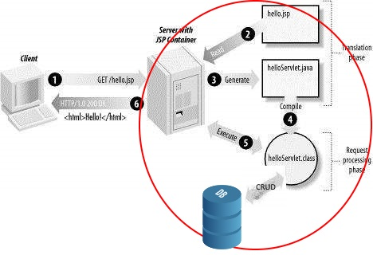
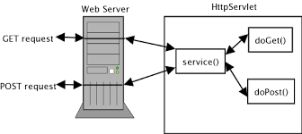

# Webprogrammering backend.

### Backend betyder det der foregår på Linux serveren 

HTML sider bliver genereret på Tomcat webserveren dynamisk. Dette bliver gjort ved at data fra databasen bliver hentet op og bliver indlejret i HTML baseret på det HTTP request der er kommet fra brugeren.

HTML bliver herefter sendt via internettet til brugerens browser. Browseren indlæser html siden og renderer et visuelt billede til brugeren (Det vi kalder en webside/web page).

  

### Ugeplan:  

| Dag     | Emne                                     |
| ------- | ---------------------------------------- |
| Mandag  | Klasseundervisning                       |
| Tirsdag | Vejledning med tutorer: Lav øvelse 1     |
| Onsdag  | Arbejd videre med Øvelse 1 og Review     |
| Torsdag | Vejledning med tutorer: Lav Cup cake web shop |
| Fredag  | Arbejd videre med Cup cake. Review med Kasper og Thomas - Demo af jeres arbejde. |

### Oversigt over emner:  

| Emne                                     | Ressourcer                               |
| ---------------------------------------- | ---------------------------------------- |
| **CUP CAKE opgaven**                     | [Find eksempel her](http://207.154.231.222/Cupcake/) |
| 1. JDBC og data mappers                  | [Eksempel her](https://github.com/HartmannDemoCode/Sem2/tree/master/DataMapper/src/main/java/data) |
| 2. HTTP: post and get requests, response, session cookie | [HTTP tutorial in 7 pages](http://www.tutorialspoint.com/http/): Læs fra overview til status codes |
| 3. Java Servlets: doPost, doGet, forward vs. sendRedirect, session object. Page Controller vs. Front Controller | [Http request](https://www.tutorialspoint.com/servlets/servlets-client-request.htm), [Http response](https://www.tutorialspoint.com/servlets/servlets-server-response.htm) [POST and GET](https://www.tutorialspoint.com/servlets/servlets-form-data.htm), [session](https://www.tutorialspoint.com/servlets/servlets-session-tracking.htm), [Front Control med servlet](https://github.com/HartmannDemoCode/Sem2/blob/master/ServletDemo/src/java/control/PageControl.java) |
| 4. JSP med HTML: template sprog,         | [Læs første 8 menu points her](https://beginnersbook.com/2013/05/jsp-tutorial-introduction/) |
| 5. MVC pattern                           | Model, View, Control: (Øvrige javaklasser, JSP, Servlet) |
| 6. SQL exceptions                        | [Overview](https://www.tutorialspoint.com/jdbc/jdbc-exceptions.htm) |
| 7. 3-lags arkitektur                     | Domæne lag: Entitets klasser og foretningslogik |
| 8.  Git og github                        | gitignore, add, commit, push, pull, clone |
| 8. Java collections -> HTML views        | See [Eksempel her](https://github.com/HartmannDemoCode/Sem2/blob/master/ServletDemo/src/java/control/Collection2Html.java) |
| 9.  SQL injection                        | [Se eksempel her](https://www.journaldev.com/2489/jdbc-statement-vs-preparedstatement-sql-injection-example) |
| 10. Cross site scripting                 | [Forklaring her](https://stackoverflow.com/questions/2658922/xss-prevention-in-jsp-servlet-web-application), [Demo project here](https://github.com/HartmannDemoCode/Sem2/tree/master/crossSideScripting) |

### Øvelser i lektionen:

1. Lav E/R diagram til oprettelse af cupcake databasen.
2. Opret et maven web project og lav jsp side med en web form til at oprette brugere: username + password. I formens action attribut kald: Control
3. Lav en Servlet: Control der kan tage request parametre fra formen og vise dem tilbage til brugeren i en viewData.jsp side. Prøv at sende dem med responset både i request objektet og i session objektet.

### Resultatet

Efter denne uge har i været igennem følgende:

1. I har lavet webapplikationer, der kan tage bruger input og føre det ned i databasen. Ligeledes at føre data fra databasen op til bruger view. 
2. I har arbejdet med design mønsteret: data mapper og i har arbejdet med SqlExceptions
3. I har arbejdet med at undgå sql injection og Cross Site Scripting

#### Læringsmål

Efter denne uge er det meningen at du kan:

- Lave en java web application med MySql database
- Bruge MVC mønsteret til at lave webapplikation
- Lave View med JSP, Control med Servlet og Model med Java entitets klasser og JDBC
- Kende til HTTP request og response samt bruge sessions
- Håndtere SQL Exceptions
- Bruge git til versionsstyring og github som fælles code base

#### Erhvervskompetencer

Når ugen er omme har du opnået følgende kompetencer:

- Kende til MVC og kunne implementere dette design mønster i en webapplikation
- Kunne bruge sessions til at opretholde 'state' i en webapplikation
- Kunne bruge JDBC og data mappers til at persistere data i en webapplikation.
- Kunne håndtere fejl fra databasen (SQL exceptions).

# Øvelser:

[Øvelse 1: ](Ex1.md) 

[Cupcake web shop:](https://docs.google.com/document/d/1DH8Apv6kSGZJc_hFKnIRcaw96WFEwf7YJZNpnPjV_E8/edit?usp=sharing) Første del af cupcake webshop øvelse. 

## Onsdag - Review   
Onsdag taler vi om de øvelser i har lavet. Vi vil gerne høre jer fortælle om hvordan i har implementeret MVC pattern i recipe appen.

| Niveau | Demo                                     |
| ------ | ---------------------------------------- |
| Grøn   | Øvelse 1: Part 1.1-1.5, Part 2.1-2.6, Part 3.1, Part 4.1-4.3 |
| Gul    | Øvelse 1: Part 1.6, Part 3.2-3.4,        |
| Rød    | Øvelse 1.3.6-7, 1.4, Part 3.5-3.8, Part 4.4, Part 5.1-5.5 |

## Fredag - Review   

Når vi mødes fredag vil vi gerne have en demo af jeres arbejde med cupcake opgaven.

Forventninger til arbejdet: gul bygger videre på grøn og rød bygger videre på gul:  

| Niveau | Demo                                     |
| ------ | ---------------------------------------- |
| Grøn   | Cupcake øvelse: Del 1-4. Alle gruppe medlemmer har commited til et fælles github repository |
| Gul    | Cupcake øvelse: Del 5                    |
| Rød    | Cupcake øvelse Del 6-7                   |

