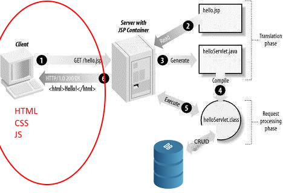

# Webprogrammering frontend.

### Frontend betyder det der sendes til browseren

HTML sider bliver genereret på Tomcat ved hjælp af JSP filer. JSP er en template engine der erstatter brugen af servletter til at danne HTML til brugeren. Med JSP får vi en java fil (Under overfladen en servlet) som vi kan skrive i som om vi skrev HTML med noget indlejret java. På Tomcat webserveren omdannes JSP til 

HTML, som  bliver sendt via internettet til brugerens browser. Browseren indlæser html siden og renderer et visuelt billede til brugeren (Det vi kalder en webside/web page).

**Vi skal arbejde med følgende emner:**

1. Mere om JSP sider og HTML
2. HTML komponenter (Form etc.)
3. Styling med CSS (Framework som bootstrap)
4. Javascript og DOM.
5. Javascript events.

### Oversigt over ugen:  

| Dag     | Emne                                  |
| ------- | ------------------------------------- |
| Mandag  | Klasseundervisning                    |
| Tirsdag | Vejledning med tutorer:               |
| Onsdag  | Arbejd videre med Øvelse samt review. |
| Torsdag | Vejledning med tutorer:               |
| Fredag  | Arbejd videre med Øvelse samt review  |

### Oversigt over mandagen:  

| Emne                                     | Ressourcer                               |
| ---------------------------------------- | ---------------------------------------- |
| 1. Styling med CSS                       | [CSS tutorial](https://www.w3schools.com/css/css_intro.asp), |
| 2. Layout med CSS                        | [Box Model](https://www.w3schools.com/css/css_boxmodel.asp), [Tables](https://www.w3schools.com/css/css_table.asp), [Forms](https://www.w3schools.com/css/css_form.asp), [Flexbox](https://www.w3schools.com/css/css3_flexbox.asp), [Navigation bar](https://www.w3schools.com/css/css_navbar.asp) |
| 3. At bruge et library: Bootstrap        | [Bootstrap tutorial](https://www.w3schools.com/bootstrap/), [Bootstrap templates](https://startbootstrap.com/template-categories/all/), [bootsnipp for små codestykker til design](https://bootsnipp.com/) |
| 4. Javascript                            | [Javascript tutorial](https://www.w3schools.com/Js/js_intro.asp), [Html events](https://www.w3schools.com/Js/js_events.asp), [arrays](https://www.w3schools.com/Js/js_arrays.asp), [array sort](https://www.w3schools.com/Js/js_array_sort.asp), [Objects](https://www.w3schools.com/Js/js_objects.asp), [Video kursus på Lynda.com: 1-6](https://www.lynda.com/JavaScript-tutorials/JavaScript-Essential-Training-2011/81266-2.html?org=cphbusiness.dk), [Regular Expression for validation](https://www.w3schools.com/jsref/jsref_obj_regexp.asp) |
| 5. Document Object Model (DOM) + Form value validation | [DOM tutorial](https://www.w3schools.com/Js/js_htmldom.asp), [Få data fra jsp session/request trukket ud i javascript](https://gist.github.com/Thomas-Hartmann/6e3670165d6528f3ff98a984ce4f4f80#file-jsp2js-jsp) |
| 6. Events og event handling              | [DOM events](https://www.w3schools.com/Js/js_htmldom_events.asp), [Event handler](https://www.w3schools.com/jsref/tryit.asp?filename=tryjsref_onclick_dom) |
| 7. JS function and callback              | [Callback introduction](http://javascriptissexy.com/understand-javascript-callback-functions-and-use-them/) |
| 8. Lambda i java og Arrow notation i ES6 | [Eksempelkode](https://github.com/HartmannDemoCode/Sem2/tree/master/CallbackInJava) |
| 9. Array.map() og Array.filter i JS.     | [Tutorial om map, filter (og reduce)](https://code.tutsplus.com/tutorials/how-to-use-map-filter-reduce-in-javascript--cms-26209) |
| 10. Functional programming               | [Introduction to functional programming with js](https://medium.com/javascript-scene/master-the-javascript-interview-what-is-functional-programming-7f218c68b3a0) |

### Gennemgang i klassen

1. Recap på ugen der er gået: Cup cake backend: [Diagram](../Week3-Backend/cupcake_diagram.png), [Example JSP drop down](https://gist.githubusercontent.com/Thomas-Hartmann/6526a1bc9fd7c3222a238026e023b5b5/raw/5a5ec8ea8442e9080eb84705a482853c23b12c1f/jspscripletselect.txt), [Full example JSP with product line](https://gist.githubusercontent.com/Thomas-Hartmann/6526a1bc9fd7c3222a238026e023b5b5/raw/7569cfcb5f50fad5ee1232853a70eee868f70508/jspscripletselect.txt) [Example Servlet: add product](https://gist.githubusercontent.com/Thomas-Hartmann/0127fbcbf918488f525feddfb599fc16/raw/4259c78866ca37f6f7625266a26af57d9776c4c0/ShoppingCart.txt), 
2. Opsætning af projekt med html, css/bootstrap og js
3. Styling af font-family, div (border, width, height, padding, margin), links: horizontal, form, button
4. Bootstrap grid, form og table
5. Javascript selector (byId, byTagName)
6. Javascript event (onclick, onsubmit)
7. Javascript effect (.style, innerHTML, form value).

### Øvelser i klassen

1. Opsæt projekt med css/bootstrap og js

2. Lav html table med personer (navn, alder).

3. Style table med bootstrap (zebra stribet)

4. Lav button og onclick event der trækker alderen ud, laver et gennemsnit og viser det i et div tag under tabellen.

5. Se resultat for js [her](https://gist.githubusercontent.com/Thomas-Hartmann/5219011ef28dc922da7f6eeb395b99f5/raw/e3072f28cc8db1e15b0a070bef2d09cd287964e1/script.js)

   ​

### Resultatet

Efter denne uge har i været igennem følgende:

1. Arbejdet med Styling af web sider både med rent CSS og med et framework som bootstrap. 
2. I har arbejdet med javascript og lavet event handlere.
3. I har brugt javascript til at lave DOM manipulation så viewet kan genrenderes baseret på brugerinput.

#### Læringsmål

Efter denne uge er det meningen at du kan:

- Redegøre for hvad DOM er og bruge JS til at Manipulere med DOMen. 
- Hente data ud af en form og bruge javascript til at verificere bruger input.
- Bruge CSS til at Style HTML sider og lave et ordentligt layout til brugeren.
- Bruge et bibliotek som bliver hentet ned fra en CDN server.

#### Erhvervskompetencer

Når ugen er omme har du opnået følgende kompetencer:

- Kunne javascript og CSS til frontend programmering.
- Kunne anvende externe biblioteker i frontend programmering.
- Kunne bruge regular expression til validering
- Kende til functionel programmering.

[Øvelse 1: Frontend opgaver](Ex1.md) 

[Øvelse 2: Arbejde videre med Cup cake shoppen](https://docs.google.com/document/d/1DH8Apv6kSGZJc_hFKnIRcaw96WFEwf7YJZNpnPjV_E8/edit?usp=sharing)

## Onsdag - Review   
Onsdag taler vi om de øvelser i har lavet. Vi vil gerne høre jer fortælle om ...

| Niveau | Demo                                 |
| ------ | ------------------------------------ |
| Grøn   | Øvelse 1.1-1.5,  2.1-2.3,  3.1-3.3.3 |
| Gul    | 3.3.4 - 3.3.5                        |
| Rød    | 3.3.6 - 3.3.8                        |

## Fredag - Review   

Når vi mødes fredag vil vi gerne have en demo af jeres arbejde med opgaverne.

Forventninger til fredag (Gul bygger videre på grøn og rød bygger videre på gul):  

| Niveau | Demo                               |
| ------ | ---------------------------------- |
| Grøn   | Øvelse 2: 9.1 - 9.3, 10.1 - 10.2   |
| Gul    | Øvelse 2: 9.4 - 9.5, 10.3 - 10.5   |
| Rød    | Øvelse 2: 10.6 - 10.8, 11.1 - 11.2 |

