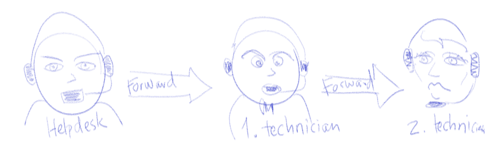

# Logging

## Workshop Emner

1. Error handling: Start med en [RECAP](https://docs.google.com/document/d/16qcFOHHfbEoIf-9EpDU7pScCk9HiKIGgI_OVniISSgM/edit?usp=sharing).

2. General logging: Using the [java.util.logging package](http://tutorials.jenkov.com/java-logging/index.html)
   1. Setup severity levels ()
   2. Setup behavior 
   3. Writing to at log file on linux server

3. [Chain of responsibility pattern](https://www.lynda.com/C-tutorials/Chain-Responsibility-pattern-explained/584140/611936-4.html?org=cphbusiness.dk)

4. On ubuntu [Logging tutorial](https://wiki.apache.org/tomcat/Logging_Tutorial)

5. [LINK til demo project](https://github.com/HartmannDemoCode/Sem2/tree/master/LoggingDemoMaven)

   1. ```
      tail -f /var/log/tomcat7/catalina.out
      ```

      1. catalina.out is where the System.out is printed on tomcat.

## Chain of responsibility



"As the name suggests, the chain of responsibility pattern creates a chain of receiver objects for a request. This pattern decouples sender and receiver of a request based on type of request. This pattern comes under behavioral patterns.

In this pattern, normally each receiver contains reference to another receiver. If one object cannot handle the request then it passes the same to the next receiver and so on." [Tutorialspoint](https://www.tutorialspoint.com/design_pattern/chain_of_responsibility_pattern.htm)

### Exercise in class

1. Use the java.util.logging package to implement a class that can log runtime exceptions to the console.
2. Extend the logger to also write to a file.
3. Create a program flow where sql exceptions are both logged to a file on the server and also generates an error message that is send to the user.
4. Test it on a deployed webapp on your droplet.

