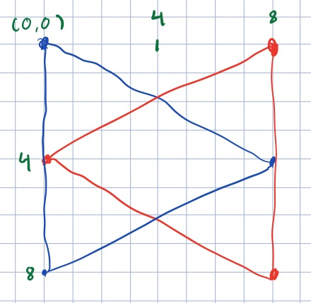
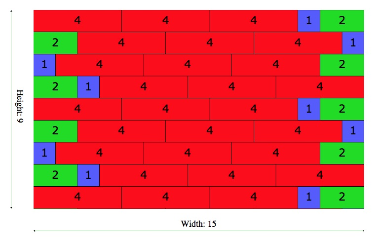

# Tegning vha. SVG


HTML indholder nogle særlige tags der kan bruges til at lave tegninger. Et eksempel kunne være dette dannebrogsflag:

<svg width="255" height="210">
<rect x="0" y="0" height="90" width="90"
        style="stroke:#000000; fill: #ff0000"/>
<rect x="120" y="0" height="90" width="135"
        style="stroke:#000000; fill: #ff0000"/>
<rect x="0" y="120" height="90" width="90"
        style="stroke:#000000; fill: #ff0000"/>
<rect x="120" y="120" height="90" width="135"
        style="stroke:#000000; fill: #ff0000"/>
</svg>

som er lavet med følgende stykke HTML:

```HTML
<SVG width="255" height=210>
<rect x="0" y="0" height="90" width="90"
        style="stroke:#000000; fill: #ff0000"/>
<rect x="120" y="0" height="90" width="135"
        style="stroke:#000000; fill: #ff0000"/>
<rect x="0" y="120" height="90" width="90"
        style="stroke:#000000; fill: #ff0000"/>
<rect x="120" y="120" height="90" width="135"
        style="stroke:#000000; fill: #ff0000"/>
</SVG>
```

For at tegne med SVG (og de fleste andre systemer) er der tre dele man skal forstå:

+ Hvilke grundelementer har man til rådighed. Typisk er det linjer, kasser, linjer, tekst mv. Flere af disse har så forskellige egenskaber man kan indstille, farver, linjetykkelse, mv.
+ Koordinat systemet. Problemet er at man her ofte arbejder med mere end et koordinat system ad gangen - det *fysiske* (på skærmen) og det *logiske* som bruges til at placere grundelementer.
+ Kanvas er det objekt man placerer sine grundelementer på. Det spiller tit en rolle i omsætningen af logiske til fysiske koordinater.

## Ressourcer
Der er flere steder på nettet som giver tutorials i SVG. 

+ [Jakob Jenkov](http://tutorials.jenkov.com/svg/index.html) har lavet en der kommer omkring det meste af hvad I får brug for.
+ Det at placere tekst helt perfekt er noget pille arbejde. 
	+ Dels har [Jenkov](http://tutorials.jenkov.com/svg/text-element.html) noget. 
	+ [Denne side også god](http://apike.ca/prog_svg_text_style.html).

## Forklaring på flagkoden
I eksemplet med flaget ovenfor, så erklærer `SVG` elementet det kanvas vi har at skrive på. De fysiske dimentioner er 255 pixels bredt, og 210 højt (flagets proportioner er [standardiserede](http://mgg.dk/dkflag/proportioner.htm)).

De grund elementer vi arbejder med er her kun rektangler (angivet med `rect` tagget). `stroke` siger at der skal være en kant, som her er sort (angivet som RGB værdi), mens `fill` siger at det rektanglet skal fyldes med rødt. Bemærk at disse egenskaber er i en `style` attribut, og man kan derfor gøre det til genstand for CSS styles hvis man vil.

Det fysiske og logiske koordinat system er her det samme (da vi ikke har angivet at det skal være forskelligt).

### Koordinat system
Husk på at X-aksen er fra venstre til højre som sædvanligt, mens Y er *oppefra og ned*.

Et simpelt eksempel på at skifte koordinat system er at vi ikke har brug for så stort et flag. I stedet for at lave alle kooridnaterne om, så angiver vi i SVG elementet en `viewBox` som er det logiske koordinat system. Et flag i halv størrelse er kan laves med:

```SVG
<SVG width="127" height=105 viewBox="0 0 255 210">
<rect x="0" y="0" height="90" width="90"
        style="stroke:#000000; fill: #ff0000"/>
... Resten som før
</SVG>
```
Her siger vi at vi vil have et kanvas der kun er 127 x 105, mens det koordinat system vi bruger til vores tegning stadit er fra 0x0 til 255x210.

<SVG width="127" height="105" viewBox="0 0 255 210">
<rect x="0" y="0" height="90" width="90"
        style="stroke:#000000; fill: #ff0000"/>
<rect x="120" y="0" height="90" width="135"
        style="stroke:#000000; fill: #ff0000"/>
<rect x="0" y="120" height="90" width="90"
        style="stroke:#000000; fill: #ff0000"/>
<rect x="120" y="120" height="90" width="135"
        style="stroke:#000000; fill: #ff0000"/>
</SVG>

Jeg tror ikke i har brug for ret meget mere i denne omgang, men I kan læse mere om viewBox på [Jakob Jenkov's side om dette](http://tutorials.jenkov.com/svg/svg-viewport-view-box.html). Hvis I mod forventning har brug for at gå amok med koordinatsystemer, så [skal i have fat i transformationer](http://tutorials.jenkov.com/svg/svg-transformation.html).


## SVG generering til JSP side
Jeg vil foreslå en tilgang til dette som minder meget om den vi brugte til at generere tabeller, nemlig at man bruger en java metode til at generere en SVG string.

Jeg har lavet et eksempel (der tegner væggen i et lego hus) som viser hvordan det kan struktureres. [Det ligger på github](https://github.com/DAT2Sem2017E/Modul5LegoSVG).

Der er to centrale elementer i løsningen. Lad os lige starte med jsp siden. Jeg  er sprunget servlets over, men sætter istedet her bare 3 variable direkte:

```
<% int length = 15; // get this from a request attribute
   int width = 9; // get this from a request attribute
   int height = 9; // ditto
%>
```
I en fuld løsning ville første linje sikkert have set sådan ud:

```java
int length = Integer.parseInt( (String)request.getAttribute("length") );
```

Nede i kroppen laver jeg et SVG kanvas der er 75% af bredden af skærmen. Hvis man ikke angiver højden regner den det ud fra proportionerne på viewport.x

```html
<svg width="75%"
     viewBox="0 0 <%=length*100+1%> <%=height*100+1%>">
	<%= SVGUtil.house(length , width, height) %>
</svg>
```

Jeg er meget glad for den jsp kommando der hedder `<%=`. Den evaluerer den java kode der er mellem `<%=` og `%>` og indsætter resultatet direkte. 

Selve metoden `house` tegner blot et antal lag svarende til hvor høj væggen skal være. Den benytter sig af en del hjælpe metoder til at få lagt brikkerne varieret og overlappende. Jeg prøver i sådanne situationer at finde en balance mellem "kryptisk kort kode", lange metoder, og mange metoder. Det er ikke sikkert din balance vil være den samme som min.

### Selve tegningen af en brik
Jeg har en metode der tegner en brik. Jeg har overkommenteret den i koden, så kik der.

Specielt det med tekster kan være noget pille arbejde. Se ressource listen oven for for nærmere info. Specielt har [denne side meget detaileret info om](http://apike.ca/prog_svg_text_style.html#) hvordan man placerer tekst i forhold til koordinater.

## Andre tilgange
Det eneste fornuftige alternativ til at generere SVG som beskrevet ovenfor er at benytte sig af tegning i JavaScript. Her vil jeg anbefale at man kikker på [w3schools afsnit om canvas](https://www.w3schools.com/graphics/canvas_intro.asp). 

# Workshop øvelse

## Del A
Lav en statisk hjemmeside med et billede at en minimal carport set fra oven. Øvelsen kan bruges som første skridt til en tegning i stil med den i dokumentet [6,0 X 7,8 MTR](https://datsoftlyngby.github.io/dat2sem2017Fall/Modul5/CP01%20DUR%20vejledning%202016.pdf) side 5.

1. Undlad at gøre plads til tallene langs siderne i første omgang. Men tegn en ramme rundt langs hele kanten af billedet. Denne rammer skal være 6 x 7,8 meter. Denne øvelse handler om at lave din første SVG tegning.
2. Tegn de to ende-spær som er helt ude ved kanten.
3. Tegn de to remme - placer dem rigtigt i forhold til rammen.
4. Tegn krydset - se om du kan få det stiplet.

## Del B
Her efter skal vi se om vi kan få de to størrelses orden streger på. Her skal vi benytte os af et trick, nemlig at man kan tage en tegning og gøre den til en del-tegning. Vi får desuden brug for at tegne pile. 

### Pile først.

<SVG width="25%" viewBox="0 0 150 40">
<defs>
    <marker id="beginArrow" 
    	markerWidth="9" markerHeight="9" 
    	refX="0" refY="4" 
    	orient="auto">
        <path d="M0,4 L8,0 L8,8 L0,4" style="fill: #000000;" />
    </marker>
    <marker id="endArrow" 
    	markerWidth="9" markerHeight="9" 
    	refX="8" refY="4" 
    	orient="auto">
        <path d="M0,0 L8,4 L0,8 L0,0" style="fill: #000000;" />
    </marker>
</defs>
<line x1="130"  y1="10" x2="12"   y2="35" 
	style="stroke:#006600;
	marker-start: url(#beginArrow);
   marker-end: url(#endArrow);"/>
</SVG>

Dette er overraskende finurligt da SVG er lavet sådan at der kan bruges alle mulige former for pilehoveder. Faktisk skal man selv tegne pilehovederne - de er små SVG tegninger i sig selv.

Pilen er lavet med følgende SVG:

```xml
<SVG width="25%" viewBox="0 0 150 40">
<defs>
    <marker id="beginArrow" 
    	markerWidth="9" markerHeight="9" 
    	refX="0" refY="4" 
    	orient="auto">
        <path d="M0,4 L8,0 L8,8 L0,4" style="fill: #000000s;" />
    </marker>
    <marker id="endArrow" 
    	markerWidth="9" markerHeight="9" 
    	refX="8" refY="4" 
    	orient="auto">
        <path d="M0,0 L8,4 L0,8 L0,0" style="fill: #000000;" />
    </marker>
</defs>
<line x1="130"  y1="10" x2="12"   y2="35" 
	style="stroke:#006600;
	marker-start: url(#beginArrow);
   marker-end: url(#endArrow);"/>
</SVG>
```      

Bemærk at det falder i to dele - en `defs` del hvor det forklares hvordan to *markere* er lavet, samt en del hvor disse markere bruges til at lave pile på en linje. 

Sidste del først, så skriver man hvilke markers man vil bruge som start og slut på pilen. Her nævner man de to markers fra defs delen.

Jeg vil anbefale at I bare kopierer de to defs til jeres projekt og bruger dem.

Men her er forklaringen.

```xml
<marker id="beginArrow" 
    markerWidth="9" markerWidth ="9" 
    refX="0" refY="4" 
    orient="auto">
    <path d="M0,4 L8,0 L8,8 L0,4" style="fill: #000000;" />
</marker>
```    

`id` er det navn vi bruger nede i linjen til at sige hvilken type pil vi vil have. `markerWidth ` og `markerWidth` angiver størrelsen på pilen. Dette er en ret lille pil.
Selve pilen er tegnet med en `path` commando, der siger at først flytter vi os til 0,4 (M for move), så tegner vi en trekant ved at lave tre linje stykker (L for linje), at at vi skal fylde figuren med sort (#000000). Denne lille tegning viser hvordan de to pile er lavet. Den røde er start pilen, den blå er slut pilen.



Så er der `orient="auto"` som magisk siger at pilen skal følge den linje vi laver. Endelig er der `refX` og `refY` som siger hvilket punkt i pilen der skal kobles på linjens endestykke. Jeg har her valgt pilens top, så pilen ikke rager ud over linjen.


### Del-billeder

Lige som man kan lave grundelementer som linjer, regtangler mv, så kan man også placere et andet svg element inde på et eksisterende kanvas. I legohus eksemplet er der en anden JSP side som tegner huset sådan her:




```XML
<svg width="75%" 
         viewBox="0 0 <%=length*100 + 200%> <%=height*100 + 200%>">
    <svg x="200" y="0" width="<%=length*100%>" height="<%=height*100%>" 
        viewBox="0 0 <%=length * 100 + 1%> <%=height * 100 + 1%>">
        <%= SVGUtil.house( length, width, height ) %>
    </svg>
    ... Drawing lines with labels
</svg>
```

Det vigtigste er linje 4 hvor der laves en viewBox for det indre svg, sådan at alt det der tegnes kan tegnes som om hele det element ligger i 0,0, og ikke som det faktisk er tilvældet, i 200,0.

Hele koden er i [samme projekt som tidligere](https://github.com/DAT2Sem2017E/Modul5LegoSVG), så kik der.

## Tilbage til Del B

Med udgangspunkt i tegningen af den flade garage, lav to pile og to labels der viser længde og bredde på carporten.
